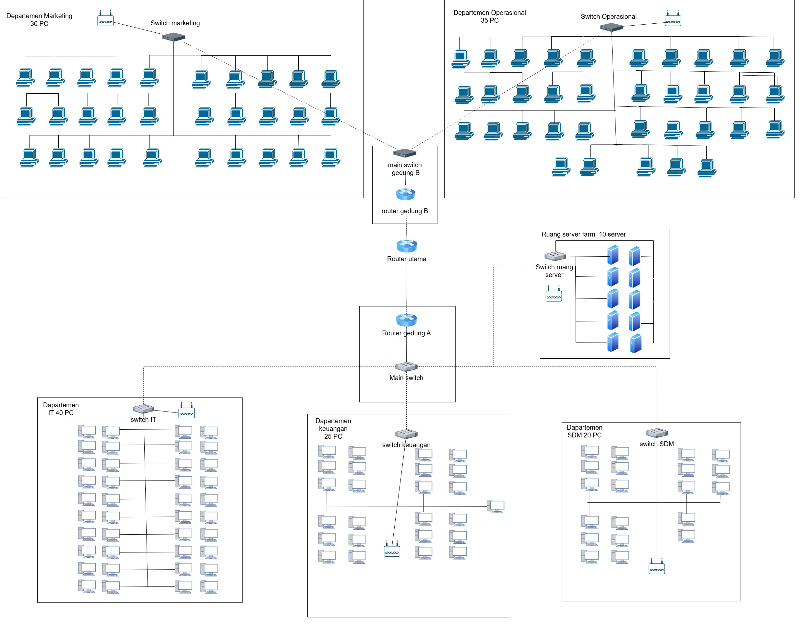
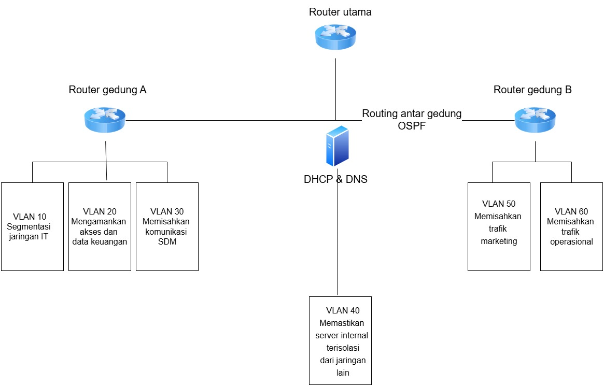
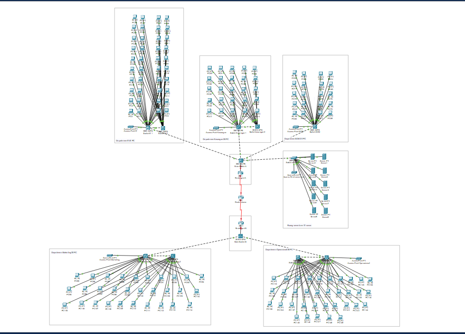

# Week 10
- Ade Ayu Kholifah Putri (10231004) - Network Architech
- Arya Wijaya Saroyo (10231020) - Network Engineer
- Krishandy Dhanysa Pratama (10231050) - Network Services Specialist
- Muhammad Dani (10231062) - Security & Documentation Specialist
## Topologi  Fisik

**Gedung A (Kantor Pusat)**:
  - 1 Router Gedung A → terkoneksi ke Router Utama dan ke Main Switch Gedung A.
  - Main switch terkoneksi ke:
    - Switch Departemen IT (40 PC)
    - Switch Departemen Keuangan (25 PC)
    - Switch Departemen SDM (20 PC)
    - Switch Ruang Server (10 Server)
  - Dilengkapi 4 Access Point untuk area IT, Keuangan, SDM, dan Umum.

**Gedung B (Kantor Cabang)**:
  - 1 Router Gedung B → terkoneksi ke Router Utama dan ke Main Switch Gedung B.
  - Main switch terkoneksi ke:
    - Switch Departemen Marketing (30 PC)
    - Switch Departemen Operasional (35 PC)
  - Dilengkapi 2 Access Point untuk Marketing dan Operasional.

**Antar Gedung**:
  - Terhubung melalui link WAN (leased line/serial) via Router Utama.
  - Router Utama juga terkoneksi ke ISP untuk internet.

## Topologi Logis

- Setiap departemen dikelompokkan dalam VLAN terpisah.
- Routing antar VLAN dilakukan oleh Router Utama.
- Server DHCP dan DNS diletakkan di VLAN Server Farm.
- Routing antar router menggunakan protokol OSPF.
- NAT dilakukan di Router Utama untuk koneksi internet publik.

## Pengalamatan IP dan VLAN
| Departemen         | VLAN ID | Subnet           | Gateway       | IP Range                      | Jumlah Host |
|--------------------|---------|------------------|---------------|-------------------------------|-------------|
| IT                 | 10      | 192.168.10.0/26  | 192.168.10.1  | 192.168.10.2–192.168.10.62    | 40 PC       |
| Keuangan           | 20      | 192.168.20.0/27  | 192.168.20.1  | 192.168.20.2–192.168.20.30    | 25 PC       |
| SDM                | 30      | 192.168.30.0/27  | 192.168.30.1  | 192.168.30.2–192.168.30.30    | 20 PC       |
| Server Farm        | 40      | 192.168.40.0/28  | 192.168.40.1  | 192.168.40.2–192.168.40.14    | 10 Server   |
| Marketing          | 50      | 192.168.50.0/27  | 192.168.50.1  | 192.168.50.2–192.168.50.30    | 30 PC       |
| Operasional        | 60      | 192.168.60.0/26  | 192.168.60.1  | 192.168.60.2–192.168.60.62    | 35 PC       |
| Link Antar Gedung  | 99      | 192.168.99.0/30  | 192.168.99.1  | 192.168.99.1–192.168.99.2     | 2 Router    |

## Daftar Perangkat yang Dibutuhkan
| Perangkat            | Jumlah | Lokasi                                    |
|----------------------|--------|--------------------------------------------|
| Router               | 3      | Router Utama, Router Gedung A & B         |
| Switch Layer 3       | 2      | Masing-masing gedung                      |
| Switch Layer 2       | 6 (+4)      | Masing-masing departemen                  |
| Server DHCP & DNS    | 2      | Ruang Server Farm                         |
| Server Aplikasi/File | 8      | Ruang Server Farm                         |
| PC                   | 150    | Total seluruh departemen                  |
| Access Point (AP)    | 6      | IT, Keuangan, SDM, Marketing, Operasional, Umum |
| Kabel UTP            | 156   | Tiap PC/server ke switch                  |
| Kabel Serial/WAN     | 2      | Antar Router Gedung A dan B               |

---

## Rencana Penerapan VLAN
| VLAN ID | Nama VLAN        | Tujuan                                           |
|---------|------------------|--------------------------------------------------|
| 10      | VLAN_IT          | Segmentasi jaringan IT                          |
| 20      | VLAN_Keuangan    | Mengamankan akses dan data keuangan             |
| 30      | VLAN_SDM         | Memisahkan komunikasi SDM                       |
| 40      | VLAN_Server      | Memastikan server internal terisolasi           |
| 50      | VLAN_Marketing   | Memisahkan trafik marketing                     |
| 60      | VLAN_Operasional | Memisahkan trafik operasional                   |
| 99      | VLAN_Backbone    | Komunikasi antar router/switch                  |

---

## Implementasi Awal Cisco

## Penjelasan

### 1. Infrastruktur utama
#### 1.1 Perangkat Router
Topologi ini menggunakan tiga buah **router Cisco 2911** yang masing-masing dipasang modul **HWIC-2T** untuk mendukung konektivitas antar gedung:

- **Router Utama**
- **Router Gedung A**
- **Router Gedung B**

Ketiga router tersebut saling terhubung menggunakan **kabel serial DCE**, dengan rincian koneksi sebagai berikut:

- Router Utama (Serial 0/3/0) → Router Gedung A (Serial 0/3/1)
- Router Utama (Serial 0/3/1) → Router Gedung B (Serial 0/3/0)

Router utama bertindak sebagai DCE dan memberikan clock rate untuk koneksi serial.

### 2. Infrastruktur Switch dan Koneksi Gedung

#### 2.1 Main Switch per Gedung
Masing-masing gedung (Gedung A dan Gedung B) dilengkapi dengan **1 unit Cisco Catalyst 3560-24PS** sebagai main switch. Switch ini berfungsi sebagai penghubung antara router dan switch di tiap departemen.

#### 2.2 Switch per Departemen
Total terdapat **9 switch Cisco 3560-24PS** yang digunakan untuk masing-masing departemen, sebagai berikut:

- IT 1 & IT 2
- Keuangan 1 & Keuangan 2
- SDM
- Marketing 1 & Marketing 2
- Operasional 1 & Operasional 2

Catatan: Beberapa departemen seperti IT, Keuangan, Marketing, dan Operasional menggunakan dua switch karena keterbatasan jumlah port pada switch 3560 di Cisco Packet Tracer (hanya 24 port).

#### 2.3 Switch Server Farm
Ruang Server Farm menggunakan **1 switch Cisco 2960** karena kebutuhan port lebih sedikit dibanding departemen lain.

### 3. Wireless Access Point (AP)

Total terdapat **6 buah Access Point (AP)** yang tersebar di:

- Setiap departemen (5 AP)
- Server Farm (1 AP)

Setiap AP terkoneksi langsung ke switch departemen atau server farm masing-masing.

### 4. Tipe Kabel yang Digunakan

Berikut adalah jenis kabel yang digunakan untuk menghubungkan perangkat:

- **PC/Server/AP ke Switch** → **Copper Straight-Through**
- **Switch ke Switch** → **Copper Cross-Over**
- **Router ke Router** (Serial) → **Serial DCE**

### 5. Pengaturan Port Switch

#### 5.1 Departemen dengan Dua Switch
Untuk departemen yang menggunakan dua switch, dilakukan penghubungan internal antar switch:

- **Switch 1 ↔ Switch 2**:
  - Port: `FastEthernet0/24 ↔ FastEthernet0/24`

- **Switch 1 ke Main Switch Gedung**:
  - Port: `FastEthernet0/23 ↔ FastEthernet0/1`
  - Port `0/1` pada main switch digunakan secara berurutan untuk tiap switch departemen.

[Link Github Pekan 10](https://github.com/BentoSaputra/DMJKKelompok11/tree/main/Pekan%2010)