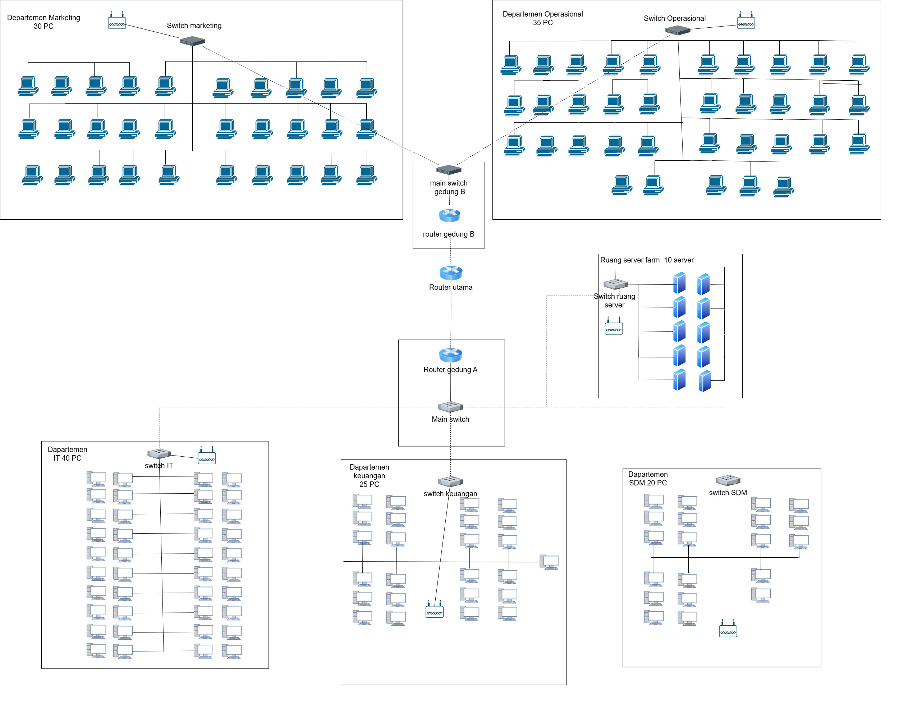
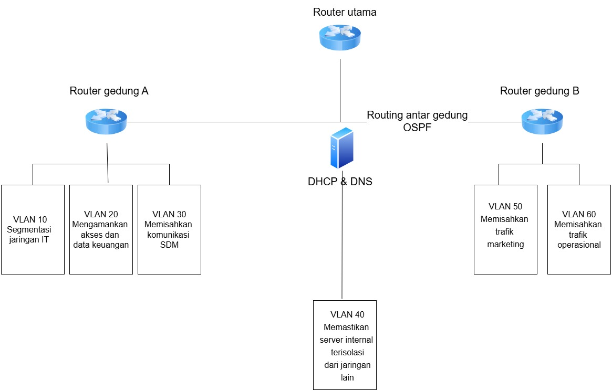
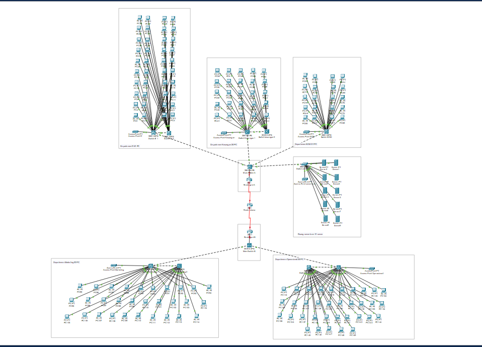
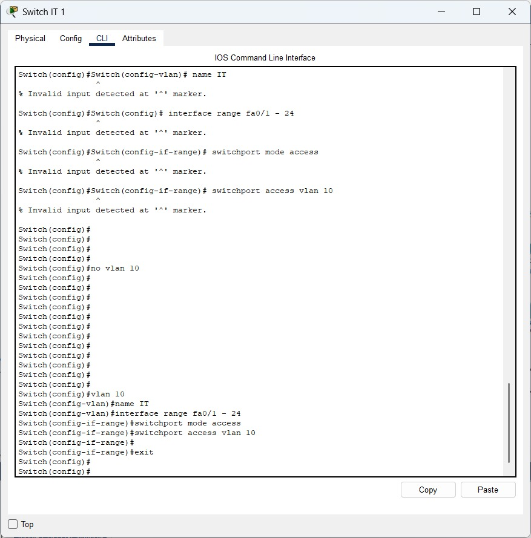
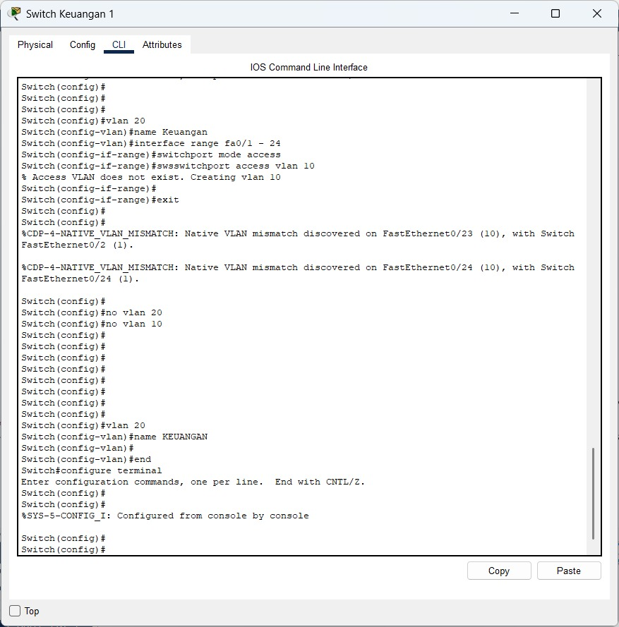
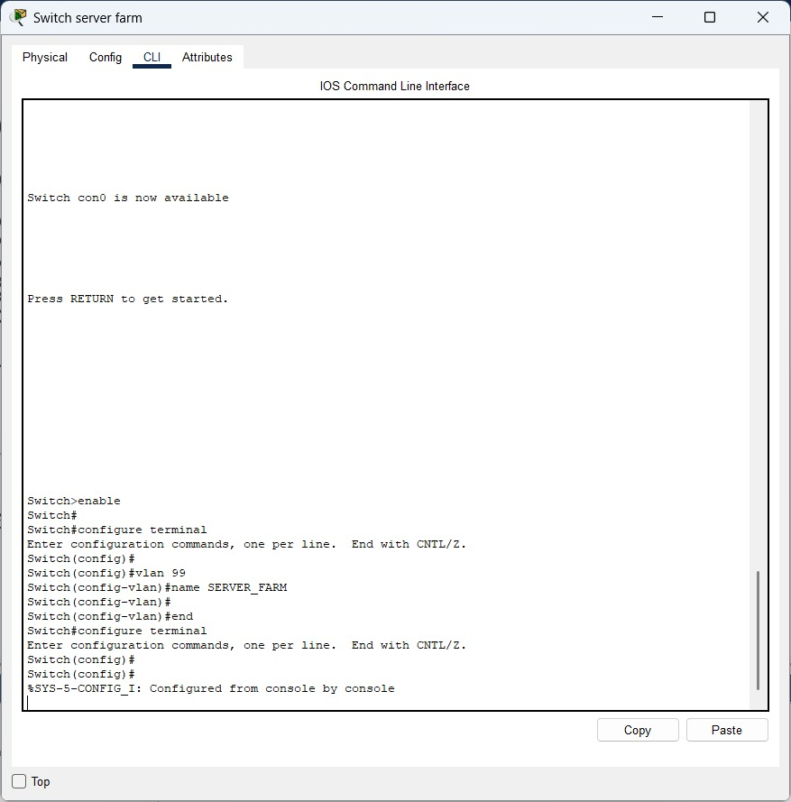
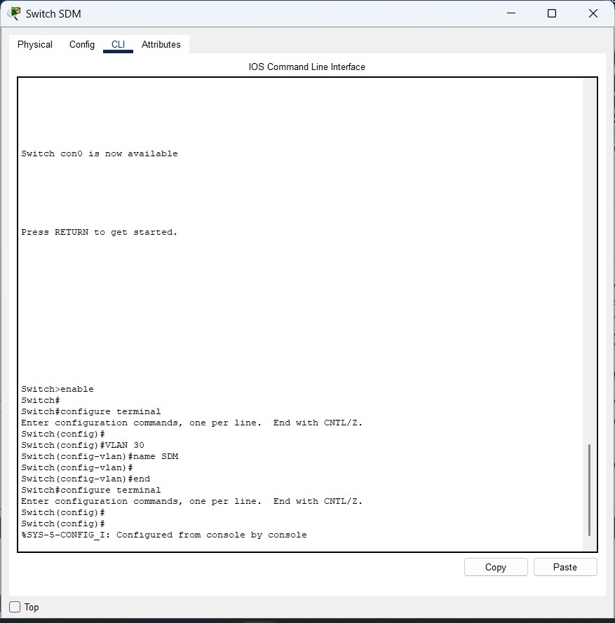
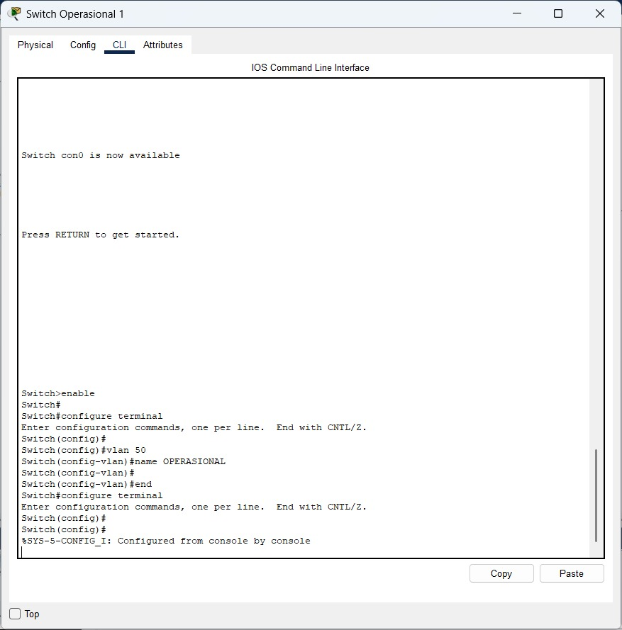
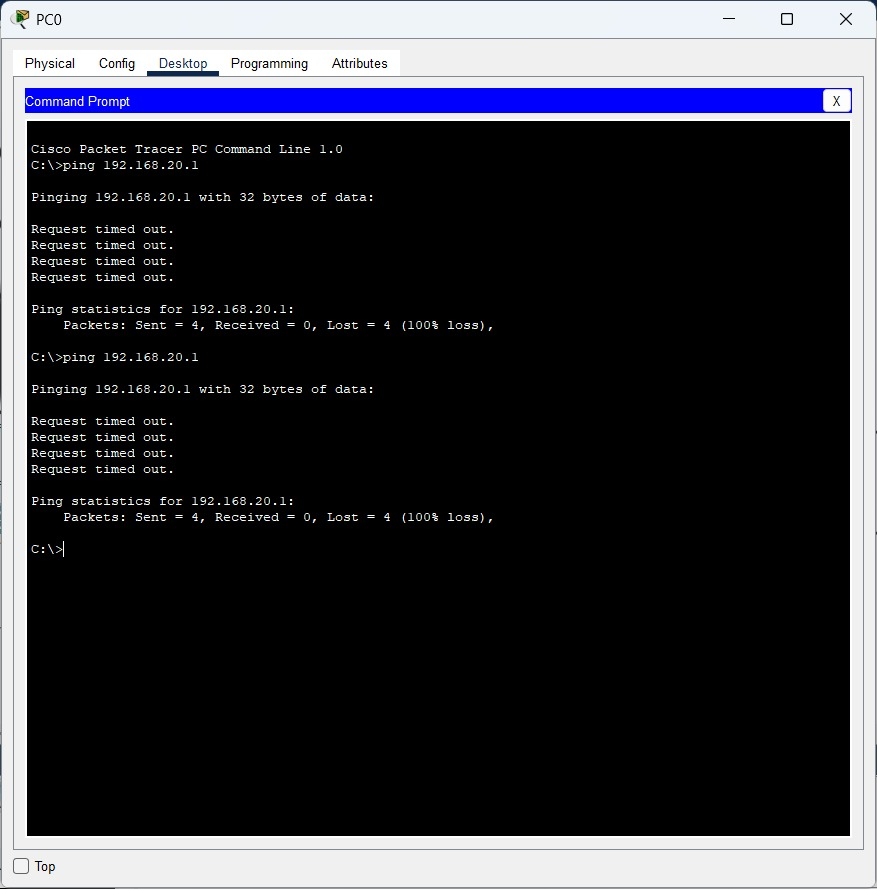

# Week 11

- Ade Ayu Kholifah Putri (10231004) - Network Architech
- Arya Wijaya Saroyo (10231020) - Network Engineer
- Krishandy Dhanysa Pratama (10231050) - Network Services Specialist
- Muhammad Dani (10231062) - Security & Documentation Specialist

-----------------------------------------

## 1. Finalisasi Desain Topologi Jaringan Dasar di Cisco Packet Tracker
### 1.1 Diagram Topologi Fisik
Diagram Topologi Fisik dibuat untuk menunjukkan susunan perangkat keras secara nyata, seperti server, switch, router, dan kabel, serta bagaimana perangkat-perangkat tersebut terhubung secara fisik di lokasi tertentu.

Gambar 2. Topologi Fisik

#

### 1.2 Diagram Topologi Logis 
Diagram Topologi Logis dibuat untuk menggambarkan alur komunikasi data antar perangkat atau sistem, serta bagaimana data berpindah dalam jaringan, meskipun perangkat-perangkat tersebut tidak selalu terhubung langsung secara fisik.

Gambar 1. Topologi Logis

#

## 1.3 Implementasi Awal Cisco

## 1.4 Penjelasan

### 1.4.1 Infrastruktur utama
#### 1.4.1.1 Perangkat Router
Topologi ini menggunakan tiga router Cisco 2911, masing-masing dilengkapi dengan modul HWIC-2T (High-Speed WAN Interface Card) untuk menyediakan dua port serial tambahan. Fungsinya adalah untuk mendukung koneksi WAN antar gedung.

- Router Utama: Sebagai pusat kontrol jaringan dan penghubung antar gedung.
- Router Gedung A (Pusat) dan - Router Gedung B (Cabang): Terhubung ke masing-masing departemen.

Koneksi antar router menggunakan kabel serial DCE dan DTE:

- Router Utama Serial 0/3/0 → Router Gedung A Serial 0/3/1
- Router Utama Serial 0/3/1 → Router Gedung B Serial 0/3/0

Router utama berperan sebagai DCE dan memberikan clock rate (misal: clock rate 64000) untuk memastikan sinkronisasi transmisi data pada koneksi serial.

### 1.4.2 Infrastruktur Switch dan Koneksi Gedung

#### 1.4.2.1 Main Switch per Gedung
Masing-masing gedung (Gedung A dan Gedung B) dilengkapi dengan **1 unit Cisco Catalyst 3560-24PS** sebagai main switch. Switch ini berfungsi sebagai penghubung antara router dan switch di tiap departemen.

#### 1.4.2.2 Switch per Departemen
Total terdapat **9 switch Cisco 3560-24PS** yang digunakan untuk masing-masing departemen, sebagai berikut:

- **Gedung A:**
  - **IT 1 & IT 2** (Total: 40 Komputer)
  - **Keuangan 1 & Keuangan 2** (Total: 25 Komputer)
  - SDM (20 Komputer)
- **Gedung B:**
  - **Marketing 1 & Marketing 2** (30 Komputer)
  - **Operasional 1 & Operasional 2** (35 Komputer)

Catatan: Beberapa departemen seperti IT, Keuangan, Marketing, dan Operasional menggunakan dua switch karena keterbatasan jumlah port pada switch 3560 di Cisco Packet Tracer (hanya 24 port).

#### 1.4.2.3 Switch Server Farm
Ruang Server Farm menggunakan **1 switch Cisco 2960** karena kebutuhan port lebih sedikit dibanding departemen lain.

### 1.4.3 Wireless Access Point (AP)

Total terdapat **6 buah Access Point (AP)** yang tersebar di:

- Setiap departemen (5 AP)
- Server Farm (1 AP)

Setiap AP terkoneksi langsung ke switch departemen atau server farm masing-masing.

### 1.4.4 Tipe Kabel yang Digunakan

Berikut adalah jenis kabel yang digunakan untuk menghubungkan perangkat:

- **PC/Server/AP ke Switch** → **Copper Straight-Through**
- **Switch ke Switch** → **Copper Cross-Over**
- **Router ke Router** (Serial) → **Serial DCE**

### 1.4.5 Pengaturan Port Switch

#### 1.4.5.1 Departemen dengan Dua Switch
Untuk departemen yang menggunakan dua switch, dilakukan penghubungan internal antar switch:

- **Switch 1 ↔ Switch 2**:
  - Port: `FastEthernet0/24 ↔ FastEthernet0/24`

- **Switch 1 ke Main Switch Gedung**:
  - Port: `FastEthernet0/23 ↔ FastEthernet0/1`
  - Port `0/1` pada main switch digunakan secara berurutan untuk tiap switch departemen.

**Topologi Tubes Cisco Packet Tracer
[Cisco.pkt](<topologi tubes.pkt>)**

## 2 Konfigurasi VLAN dan Trunking
Masing-masing departemen dibuatkan **VLAN terpisah** sesuai dengan kebutuhan keamanan dan segmentasi jaringan. Semua **switch antar departemen** terkoneksi melalui **port trunking** untuk membawa banyak VLAN dalam satu jalur.

| No | Departemen | VLAN ID |	Subnet IP|
|---|---|---|---|
|1	| IT	| 10	| 192.168.10.0/24 |
|2	| Marketing |	40	| 192.168.20.0/24 |
|3	| Keuangan | 20	| 192.168.30.0/24 |
|4	| SDM	| 30	| 192.168.40.0/24 |
|5	| Operasional	| 50	| 192.168.50.0/24 |
|6	| Server Farm	| 99	| 192.168.99.0/24 |
### 2.1 Konfigurasi VLAN Switch Departemen IT 

### 2.2 Konfigurasi VLAN Switch Departemen Marketing

### 2.3 Konfigurasi VLAN Departemen Keuangan

### 2.4 Konfigurasi Server Farm

### 2.5 Konfigurasi VLAN SDM

### 2.6 Konfigurasi VLAN Departemen Operasional

## 3 Implementasi Routing antar VLAN
### (Hasil Pengujian kontektivitas antar VLAN  screenshoot dan penjelasan)

Setelah semua konfigurasi selesai, dilakukan uji koneksi menggunakan fitur ping dan web browser dari PC ke server, dan antar VLAN. Semua koneksi berhasil sesuai dengan aturan ACL yang ditetapkan.

## 4 Kendala yang dihadapi dan Solusinya
### 4.1 Kendala
Dari tim kelompok kami mengalami kendala pada bagian konfigurasi Router dengan hasil ping `Request Timed Out`

### 4.2 Solusi
Saat ini masih belum ada solusi dikarenakan keterbatasan waktu dan kelalaian kami dalam memanagement waktu kami

[Link Github Pekan 11](https://github.com/BentoSaputra/DMJKKelompok11/tree/main/Pekan%2011)