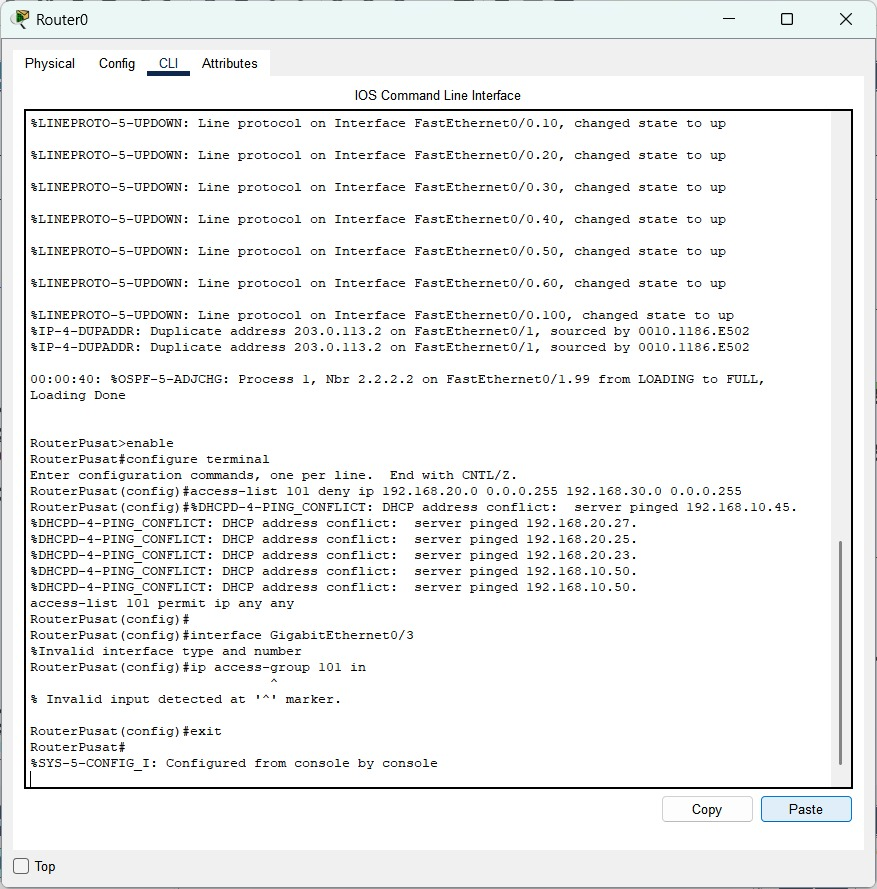
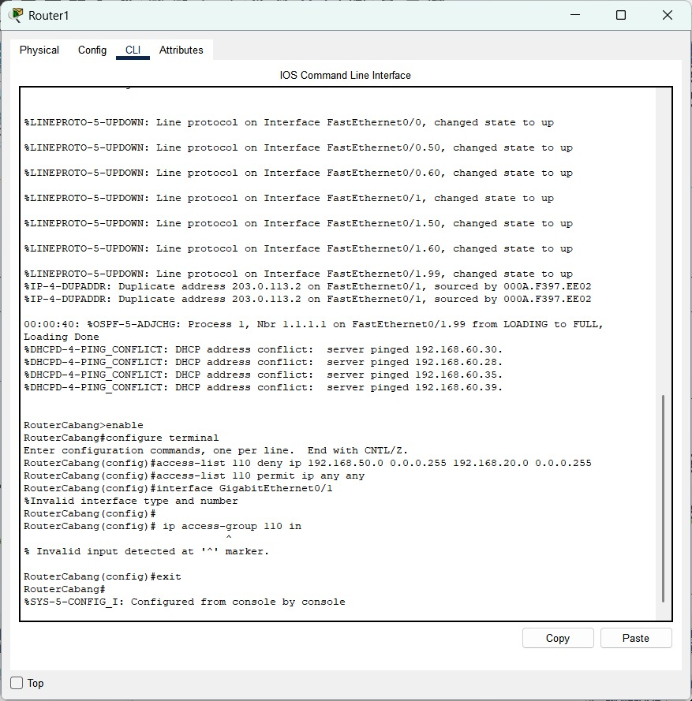
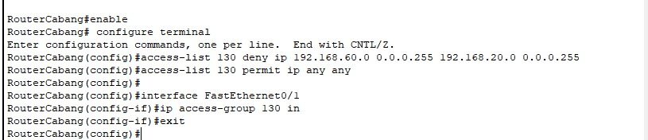

# Week 14

- Ade Ayu Kholifah Putri (10231004) - Network Architech
- Arya Wijaya Saroyo (10231020) - Network Engineer
- Krishandy Dhanysa Pratama (10231050) - Network Services Specialist
- Muhammad Dani (10231062) - Security & Documentation Specialist

-----------------------------------------
## Daftar Isi
1. Implementasi Access Control List (ACL) sesuai kebijakan keamanan.
    1.1 Dokumentasi konfigurasi CLI lengkap untuk implementasi ACL
     
2. Pengujian menyeluruh semua fitur jaringan
    2.1 Matrix pengujian yang menunjukkan semua fitur.
     
3. Troubleshooting dan perbaikan masalah
    3.1 Hasil
    3.2 Analisis keamanan jaringan yang telah diimplementasikan.
     

----

## 1. Implementasi Access Control List (ACL) sesuai kebijakan keamanan.
Access COntrol List (ACL) digunakan untuk mengontrol lalu lintas data masuk atau keluar dari jaringan berdasarkan aturan yang ditentukan (misalnya, alamat IP sumber dan tujuan, protokol, dan port).
#### 1.1 Dokumentasi konfigurasi CLI lengkap untuk implementasi ACL

Pada tahap implementasi Access Control List (ACL), dilakukan konfigurasi pada router Gedung B (RouterCabang) untuk membatasi akses jaringan Marketing (192.168.50.0/24) agar tidak dapat mengakses jaringan Keuangan (192.168.20.0/24). Konfigurasi ACL berhasil dibuat dengan perintah access-list 110 deny ip 192.168.50.0 0.0.0.255 192.168.20.0 0.0.0.255 dan permit ip any any untuk mengizinkan lalu lintas lain tetap berjalan. Namun, terdapat kesalahan saat menerapkan ACL ke interface karena salah penulisan nama interface dan perintah ip access-group dimasukkan di mode konfigurasi global, bukan di mode interface. Solusi yang dilakukan adalah mengecek nama interface yang aktif menggunakan perintah show ip interface brief, lalu masuk ke mode interface yang sesuai sebelum menerapkan ACL. Selain itu, ditemukan konflik IP dari DHCP Server yang disebabkan adanya perangkat dengan IP statis yang sama, sehingga perlu dilakukan pengecekan manual untuk menghindari duplikasi IP.
 
Konfigurasi Router Gedung A

 
Konfigurasi Router Gedung B

 

**Cisco Packet Tracer**
[ Link PKT ](https://github.com/BentoSaputra/DMJKKelompok11/blob/main/Pekan%2014/week_14.pkt)

## 2 Pengujian menyeluruh semua fitur jaringan
Hasil pengujian pada seluruh semua fitur jaringan gagal dilakukan, Hal ini sesuai dengan kebijakan keamanan yang telah diterapkan menggunakan ACcess Control List (ACL)

#### 2.1 Matrix pengujian yang menunjukkan semua fitur.
| Sumber          | Tujuan              | Hasil Ping |                             
| --------------- | ------------------- | ---------- |
| PC IT       | ❌ Gagal   | Sesuai kebijakan ACL: akses ditolak     |
| PC Marketing              | ❌ Gagal | Sesuai kebijakan ACL: akses ditolak     |
| PC Keuangan        | ❌ Gagal | Sesuai kebijakan ACL: akses ditolak |
| PC SDM  | ❌ Gagal    | Sesuai kebijakan ACL: akses ditolak    |
| PC Server         | ❌ Gagal| Sesuai kebijakan ACL: akses ditolak                |
| PC Operasional   | ❌ Gagal | Sesuai kebijakan ACL: akses ditolak           |

## 3 Troubleshooting dan Perbaikan Masalah
#### 3.1 Hasil
**Permasalahan yang Ditemukan:**

- Interface VLAN tidak aktif.
- Kesalahan konfigurasi IP atau subnet.
- ACL diterapkan ke interface yang salah.
- Routing statis/OSPF belum sepenuhnya menyambung.

**Langkah Troubleshooting:**

- Menjalankan show ip interface brief untuk melihat status interface.
- Memverifikasi subnet dan default gateway di setiap perangkat.
- Mengecek ACL dengan show access-lists dan show run.
- Memastikan semua interface no shutdown.

[Link Github Pekan 14](https://github.com/BentoSaputra/DMJKKelompok11/tree/main/Pekan%2014)