# Week 15

- Ade Ayu Kholifah Putri (10231004) - Network Architech
- Arya Wijaya Saroyo (10231020) - Network Engineer
- Krishandy Dhanysa Pratama (10231050) - Network Services Specialist
- Muhammad Dani (10231062) - Security & Documentation Specialist

-----------------------------------------
## Daftar Isi
1. Perencanaan Proyek & Desain Awal
    1.1 Pendahuluan
    1.2 Latar Belakang
    1.3 Ruang Lingkup
    1.4 Jadwal dan Delieverable Pekan
    1.5 Analisis Kebutuhan PT. Nusantara Network

2. Desain Topologi & Skema Pengalamatan
    2.1 Topologi
    2.2 Pengalamatan IP dan VLAN
    2.3 Penjelasan

3. Implementasi Topologi Dasar & VLAN
    3.1 Finalisasi Desain Topologi Jaringan Dasar di Cisco Packet Tracer
    3.2 Konfigurasi VLAN dan Trunking
    3.3 Implementasi Routing antar VLAN

4. Implementasi Routing & WAN
    4.1 Konfigurasi Routing Statis
    4.2 Implementasi Routing Dinamis (OSPF) untuk koneksi antar-gedung
    4.3 Simulasi koneksi WAN antar gedung.

5. Implementasi Layanan Jaringan
    5.1 CLI Router DHCP
    5.2 Konfigurasi DNS
    5.3 Konfigurasi DHCP

6. Implementasi Keamanan & Pengujian
    5.1. Implementasi Access Control List (ACL) sesuai kebijakan keamanan.
    5.2. Pengujian menyeluruh semua fitur jaringan
    5.3. Troubleshooting dan perbaikan masalah.

7. Kendala dan Solusi
    7.1 Kendala
    7.2 Solusi

----
### 1. Perencanaan Proyek & Desain Awal

#### 1.1 Pendahuluan
Perkembangan teknologi informasi saat ini telah membawa dampak besar terhadap operasional perusahaan di berbagai sektor. Infrastruktur jaringan komputer menjadi tulang punggung dalam mendukung proses komunikasi, pengolahan data, serta layanan digital internal perusahaan. PT. Nusantara Network, sebagai perusahaan yang bergerak di bidang teknologi informasi, membutuhkan sistem jaringan yang andal, aman, dan efisien untuk mendukung aktivitas seluruh departemen di kantor pusat maupun cabang. 
    
Seiring dengan meningkatnya kompleksitas operasional, PT. Nusantara Network memiliki kebutuhan untuk membangun infrastruktur jaringan yang mampu menjamin keamanan antar departemen, efisiensi pertukaran data antar gedung, serta kemudahan dalam pengelolaan sistem secara terpusat. Oleh karena itu, diperlukan analisis kebutuhan jaringan yang menyeluruh sebagai dasar dalam perencanaan dan implementasi sistem jaringan perusahaan yang optimal.

#### 1.2 Latar Belakang
PT. Nusantara Network memiliki dua lokasi operasional utama, yaitu kantor pusat (Gedung A) dan kantor cabang (Gedung B), dengan masing-masing terdiri atas beberapa departemen dan unit kerja. Total perangkat yang digunakan meliputi puluhan komputer client dan beberapa server yang menjalankan berbagai layanan penting perusahaan.

Kondisi tersebut menuntut penerapan teknologi jaringan yang mampu mengakomodasi kebutuhan khusus seperti segmentasi jaringan antar departemen, akses internet terpusat, serta konektivitas antar lokasi yang stabil meskipun menggunakan bandwidth terbatas. Selain itu, dibutuhkan pula pengaturan layanan jaringan seperti DHCP, DNS, dan pengamanan akses melalui Access Control List (ACL). Dalam hal pengelolaan dan skalabilitas jaringan, penggunaan routing dinamis seperti OSPF dan sistem monitoring jaringan menjadi hal yang penting untuk dipertimbangkan.

Melalui proposal ini, tim kami bertujuan untuk menyusun analisis kebutuhan infrastruktur jaringan yang akan menjadi landasan awal dalam merancang sistem jaringan yang sesuai dengan kebutuhan dan tantangan yang dihadapi oleh PT. Nusantara Network.

#### 1.3 Ruang Lingkup
Ruang lingkup dalam proposal ini mencakup analisis kebutuhan infrastruktur jaringan PT. Nusantara Network berdasarkan struktur organisasi, jumlah perangkat, dan kebutuhan layanan jaringan. Fokus utama dari ruang lingkup ini adalah:

1. Analisis Topologi Jaringan untuk kantor pusat dan kantor cabang.
2. Perancangan VLAN untuk segmentasi antar departemen.
3. Kebutuhan koneksi WAN antar lokasi dengan bandwidth terbatas.
 4. Implementasi NAT untuk akses internet melalui ISP.
5. Penerapan layanan DHCP dan DNS untuk pengaturan alamat IP dan resolusi nama.
6. Perancangan Access Control List (ACL) untuk pembatasan akses antar VLAN.
7. Penggunaan protokol routing dinamis (OSPF) untuk pengelolaan rute jaringan.
8. Sistem monitoring dan manajemen jaringan terpusat untuk pemantauan performa dan keamanan jaringan.
    
Ruang lingkup ini tidak mencakup implementasi fisik atau konfigurasi langsung perangkat, namun lebih berfokus pada tahap analisis kebutuhan dan rancangan awal infrastruktur jaringan.

#### 1.4 Jadwal dan Delieverable Pekan
Jadwal dan Delieverable Pekan berisikan urutan waktu pelaksanaan dalam analisis yang dilakukan oleh kelompok kami, dan pengerjaan pada PT. Nusantara Network Sebagai Berikut.

##### Jadwal
| Pekan | Kegiatan | Deadline |
|-------|----------|----------|
|Pekan 9|1. Pembagian Kelompok dan Pembagian Peran 2. Analisis Kebutuhan PT. Nusantara Network 3. Brainstorming desain jaringan awal.|Minggu, 13 April 2025|
|Pekan 10|1. Finalisasi desain topologi jaringan. 2. Perencanaan skema pengalamatan IP (subnetting).3. Penentuan perangkat yang dibutuhkan.|Jum`at, 18 April 2025|
|Pekan 11|1. Pembangunan topologi dasar di Cisco Packet Tracer/GNS3. 2. Konfigurasi VLAN dan trunking. 3. Implementasi routing antar-VLAN.|Jum`at, 25 April 2025|
|Pekan 12|1. Konfigurasi routing statis pada jaringan intra-gedung. 2. Implementasi routing dinamis (OSPF) untuk koneksi antar-gedung 3. Simulasi koneksi WAN antar gedung. |Jum`at, 2 Mei 2025|
|Pekan 13|1. Konfigurasi DHCP Server untuk setiap departemen. 2. Implementasi DNS Server untuk resolusi nama internal. 3. Konfigurasi NAT untuk akses internet.|Jum`at, 9 Mei 2025|
|Pekan 14|1. Implementasi Access Control List (ACL) sesuai kebijakan keamanan. 2. Pengujian menyeluruh semua fitur jaringan. 3. Troubleshooting dan perbaikan masalah.|Jum`at, 16 Mei 2025|
|Pekan 15|1. Finalisasi semua dokumentasi proyek. 2. Persiapan presentasi akhir. 3. Pembuatan video demo/tutorial jaringan yang telah diimplementasikan.|Jum`at, 23 Mei 2025|

### 1.5 Analisis Kebutuhan PT. Nusantara Network
PT. Nusantara Network merupakan perusahaan yang bergerak di bidang teknologi informasi dengan kebutuhan jaringan yang kompleks, mencakup keamanan data, efisiensi komunikasi, serta kemudahan dalam pengelolaan jaringan. Infrastruktur jaringan harus dirancang untuk melayani dua lokasi yaitu kantor pusat (Gedung A) dan kantor cabang (Gedung B), dengan masing-masing lokasi memiliki beberapa departemen.

1. Segmentasi Jaringan dengan VLAN
Untuk menjamin keamanan data dan menghindari kemacetan lalu lintas jaringan antar departemen, perlu dilakukan segmentasi jaringan menggunakan Virtual Local Area Network (VLAN). Setiap departemen akan ditempatkan dalam VLAN yang berbeda agar dapat mengisolasi lalu lintas data antar divisi, serta mempermudah pengaturan akses dan troubleshooting.
    Rancangan VLAN yang Dibutuhkan:
    - VLAN 10: Departemen IT (40 perangkat)
    - VLAN 20: Departemen Keuangan (25 perangkat)
    - VLAN 30: Departemen SDM (20 perangkat)
    - VLAN 40: Departemen Marketing (30 perangkat)
    - VLAN 50: Departemen Operasional (35 perangkat)
    - VLAN 99: Server Farm (10 server)

    Setiap VLAN akan dikonfigurasi dengan subnet yang berbeda agar memudahkan pengalokasian IP dan manajemen lalu lintas jaringan.

2. Koneksi Antar Gedung (WAN)
    Koneksi antara kantor pusat dan kantor cabang memerlukan jaringan Wide Area Network (WAN). Karena lokasi berada di gedung yang berbeda, koneksi WAN menjadi krusial untuk memastikan kelancaran komunikasi dan transfer data antar cabang.
    Teknologi yang Direkomendasikan:
- VPN Site-to-Site jika ingin solusi hemat biaya menggunakan jaringan internet.
- Leased Line atau MPLS jika memerlukan koneksi lebih stabil dan aman.
- Pertimbangan Bandwidth: Mengingat koneksi WAN memiliki bandwidth terbatas, perlu dilakukan pengaturan Quality of Service (QoS) agar trafik penting seperti akses ke server memiliki prioritas tinggi.

3. Implementasi NAT (Network Address Translation)
Akses ke internet akan menggunakan NAT, yang berfungsi untuk menerjemahkan alamat IP privat dari masing-masing perangkat dalam jaringan ke alamat IP publik dari penyedia layanan internet (ISP).
Hanya alamat IP publik dari ISP yang terlihat di internet, sementara alamat IP internal tetap tersembunyi demi keamanan.

4. Layanan DHCP untuk Alokasi IP Otomatis
Agar pengalokasian alamat IP lebih efisien dan menghindari konflik IP, setiap departemen memerlukan layanan Dynamic Host Configuration Protocol (DHCP).
DHCP dapat disediakan secara terpusat atau disebarkan ke masing-masing VLAN.
Untuk distribusi antar VLAN, dibutuhkan fitur DHCP Relay pada router atau switch Layer 3 agar setiap perangkat bisa mendapatkan IP sesuai subnet VLAN-nya.

5. Layanan DNS (Domain Name System)
DNS diperlukan untuk menerjemahkan nama domain menjadi alamat IP, baik untuk keperluan internal (intranet) maupun eksternal (internet).

- DNS Internal: Mengatur domain lokal seperti fileserver.nusnet.local.

- DNS Eksternal: Mengarahkan permintaan eksternal ke DNS publik (seperti Google DNS 8.8.8.8).

    Disarankan untuk memiliki DNS Primer dan Sekunder agar layanan tetap tersedia jika salah satu DNS gagal.

6. Access Control List (ACL) untuk Keamanan Lalu Lintas
Untuk memperkuat keamanan jaringan, perlu diterapkan Access Control List (ACL) pada perangkat Layer 3 seperti router atau switch multilayer.
Fungsi ACL adalah membatasi akses antar VLAN sesuai kebijakan yang ditentukan.
Contoh kebijakan:
- Departemen SDM hanya bisa mengakses layanan internet dan file sharing terbatas.
- Departemen IT memiliki akses penuh ke semua departemen untuk keperluan teknis.
- Server Farm hanya dapat diakses oleh departemen tertentu saja.

7. Routing Dinamis dengan OSPF
Untuk pengelolaan rute jaringan yang efisien antar gedung dan antar VLAN, digunakan protokol Open Shortest Path First (OSPF).
- OSPF secara otomatis memperbarui rute jika terjadi perubahan jaringan.

- Mengurangi kebutuhan konfigurasi manual seperti pada routing statis.

- Cukup menggunakan satu area (Area 0) karena kompleksitas jaringan masih dalam skala menengah.

8. Monitoring dan Manajemen Jaringan Terpusat
Agar jaringan tetap dalam kondisi optimal dan mudah dikontrol, dibutuhkan sistem pemantauan yang menyeluruh.

Gunakan aplikasi monitoring seperti:

- Zabbix, PRTG Network Monitor, atau SolarWinds.

Fungsi Monitoring:

- Memantau kinerja perangkat jaringan (router, switch, server).

- Memberikan notifikasi jika terjadi gangguan.

- Merekam log aktivitas untuk audit dan troubleshooting.

Gunakan protokol SNMP dan sistem log terpusat agar semua aktivitas dapat dimonitor dari satu dashboard.
d

-------------------------------------------------------------

### 2. Desain Topologi & Skema Pengalamatan

#### 2.1 Topologi
**Topologi Fisik**
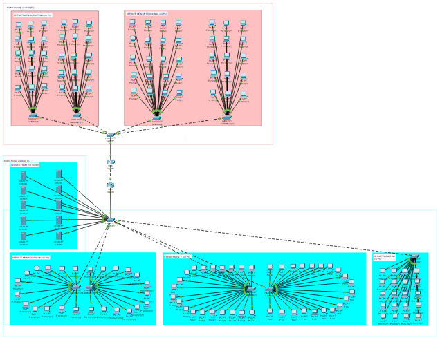

Gedung A (Kantor Pusat):

- 1 Router Gedung A → terkoneksi ke Router Gedung B dan ke Main Switch Gedung A.
- Main switch terkoneksi ke:
    -  Switch Departemen IT (40 PC)
    - Switch Departemen Keuangan (25 PC)
    - Switch Departemen SDM (20 PC)
    - Switch Ruang Server (10 Server)
- Dilengkapi 4 Access Point untuk area IT, Keuangan, SDM, dan Umum.
Gedung B (Kantor Cabang):

- 1 Router Gedung B → terkoneksi ke Router Gedung A dan ke Main Switch Gedung B.
- Main switch terkoneksi ke:
    - Switch Departemen Marketing (30 PC)
    - Switch Departemen Operasional (35 PC)
- Dilengkapi 2 Access Point untuk Marketing dan Operasional.

**Topologi Logis**
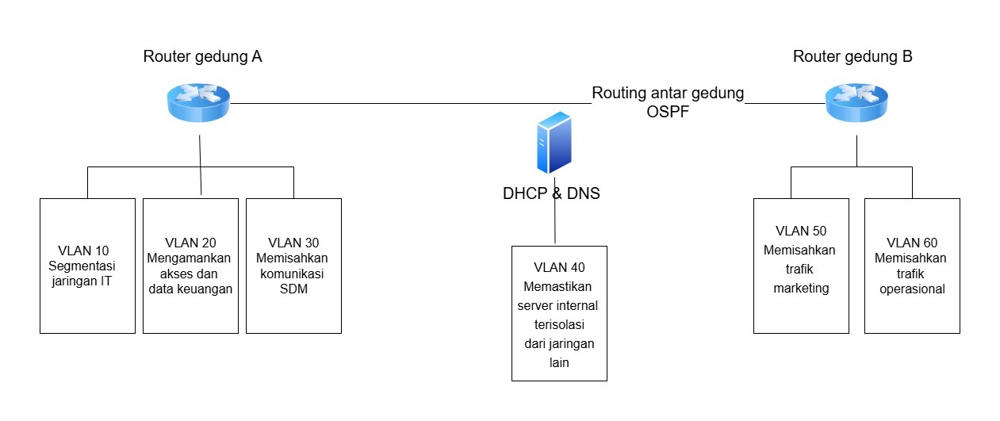
- Setiap departemen dikelompokkan dalam VLAN terpisah.
- Routing antar VLAN dilakukan oleh Server.
- Server DHCP dan DNS diletakkan di VLAN Server Farm.
- Routing antar router menggunakan protokol OSPF.
- NAT dilakukan di Server untuk koneksi internet publik.

### 2.2 Pengalamatan IP dan VLAN
| Departemen         | VLAN ID | Subnet           | Gateway       | IP Range                      | Jumlah Host |
|--------------------|---------|------------------|---------------|-------------------------------|-------------|
| IT                 | 10      | 192.168.10.0/26  | 192.168.10.1  | 192.168.10.2–192.168.10.62    | 40 PC       |
| Keuangan           | 20      | 192.168.20.0/27  | 192.168.20.1  | 192.168.20.2–192.168.20.30    | 25 PC       |
| SDM                | 30      | 192.168.30.0/27  | 192.168.30.1  | 192.168.30.2–192.168.30.30    | 20 PC       |
| Server Farm        | 40      | 192.168.40.0/28  | 192.168.40.1  | 192.168.40.2–192.168.40.14    | 10 Server   |
| Marketing          | 50      | 192.168.50.0/27  | 192.168.50.1  | 192.168.50.2–192.168.50.30    | 30 PC       |
| Operasional        | 60      | 192.168.60.0/26  | 192.168.60.1  | 192.168.60.2–192.168.60.62    | 35 PC       |
| Link Antar Gedung  | 99      | 192.168.99.0/30  | 192.168.99.1  | 192.168.99.1–192.168.99.2     | 2 Router    |

## Daftar Perangkat yang Dibutuhkan
| Perangkat            | Jumlah | Lokasi                                    |
|----------------------|--------|--------------------------------------------|
| Router               | 2      | Router Gedung A & B         |
| Switch Layer 3       | 2      | Masing-masing gedung                      |
| Switch Layer 2       | 6 (+4)      | Masing-masing departemen                  |
| Server DHCP & DNS    | 2      | Ruang Server Farm                         |
| Server Aplikasi/File | 8      | Ruang Server Farm                         |
| PC                   | 150    | Total seluruh departemen                  |
| Kabel UTP            | 155   | Tiap PC/server ke switch                  |

---

## Rencana Penerapan VLAN
| VLAN ID | Nama VLAN        | Tujuan                                           |
|---------|------------------|--------------------------------------------------|
| 10      | VLAN_IT          | Segmentasi jaringan IT                          |
| 20      | VLAN_Keuangan    | Mengamankan akses dan data keuangan             |
| 30      | VLAN_SDM         | Memisahkan komunikasi SDM                       |
| 40      | VLAN_Server      | Memastikan server internal terisolasi           |
| 50      | VLAN_Marketing   | Memisahkan trafik marketing                     |
| 60      | VLAN_Operasional | Memisahkan trafik operasional                   |


### 2.3 Penjelasan

#### 2.3.1 Infrastruktur utama

**Perangkat Router**

Topologi ini menggunakan tiga buah **router Cisco 2911** yang masing-masing dipasang modul **HWIC-2T** untuk mendukung konektivitas antar gedung:

- **Router Gedung A**
- **Router Gedung B**

#### 2.3.2 Infrastruktur Switch dan Koneksi Gedung

**Main Switch per Gedung**
Masing-masing gedung (Gedung A dan Gedung B) dilengkapi dengan **1 unit Cisco Catalyst 2960-24TT** sebagai main switch. Switch ini berfungsi sebagai penghubung antara router dan switch di tiap departemen.

**Switch per Departemen**
Total terdapat **9 switch Cisco 2960-24TT** yang digunakan untuk masing-masing departemen, sebagai berikut:

- IT 1 & IT 2
- Keuangan 1 & Keuangan 2
- SDM
- Marketing 1 & Marketing 2
- Operasional 1 & Operasional 2

Catatan: Beberapa departemen seperti IT, Keuangan, Marketing, dan Operasional menggunakan dua switch karena keterbatasan jumlah port pada switch 3560 di Cisco Packet Tracer (hanya 24 port).

**Switch Server Farm**
Ruang Server Farm menggunakan Switch yang langsung terhubung dengan main switch gedung A.

#### 2.3.3. Tipe Kabel yang Digunakan

Berikut adalah jenis kabel yang digunakan untuk menghubungkan perangkat:

- **PC/Server/AP ke Switch** → **Copper Straight-Through**
- **Switch ke Switch** → **Copper Straight-Through**
- **Router ke Router** → **Copper Straight-Through**

### 2.3.4. Pengaturan Port Switch

** Departemen dengan Dua Switch**
Untuk departemen yang menggunakan dua switch, dilakukan penghubungan internal antar switch:

- **Switch 1 ↔ Switch 2**:
  - Port: `FastEthernet0/24 ↔ FastEthernet0/24`

- **Switch 1 ke Main Switch Gedung**:
  - Port: `FastEthernet0/23 ↔ FastEthernet0/1`
  - Port `0/1` pada main switch digunakan secara berurutan untuk tiap switch departemen.

------------------------------------------------------------------

### 3. Implementasi Topologi Dasar & VLAN
#### 3.1 Finalisasi Desain Topologi Jaringan Dasar di Cisco Packet Tracer
Diagram Topologi Fisik dibuat untuk menunjukkan susunan perangkat keras secara nyata, seperti server, switch, router, dan kabel, serta bagaimana perangkat-perangkat tersebut terhubung secara fisik di lokasi tertentu.
**Topologi Fisik**

<p align="center">Gambar 2. Topologi Fisik</p>

Diagram Topologi Logis dibuat untuk menggambarkan alur komunikasi data antar perangkat atau sistem, serta bagaimana data berpindah dalam jaringan, meskipun perangkat-perangkat tersebut tidak selalu terhubung langsung secara fisik.
**Topologi Logis**

<p align="center">Gambar 1. Topologi Logis</p>

#### Infrastruktur utama
**Perangkat Router**
Topologi ini menggunakan dua router Cisco 1841, masing-masing dilengkapi dengan modul HWIC-2T (High-Speed WAN Interface Card) untuk menyediakan dua port serial tambahan. Fungsinya adalah untuk mendukung koneksi WAN antar gedung.

- Router Gedung A (Pusat) dan - Router Gedung B (Cabang): Terhubung ke masing-masing departemen. dan saling menghubungi

Koneksi antar router menggunakan kabel  Copper Straight-Through

#### Infrastruktur Switch dan Koneksi Gedung**

**Main Switch per Gedung**
Masing-masing gedung (Gedung A dan Gedung B) dilengkapi dengan **1 unit Cisco Catalyst 2960-24TT** sebagai main switch. Switch ini berfungsi sebagai penghubung antara router dan switch di tiap departemen.

**Switch per Departemen**
Total terdapat **9 switch Cisco 2960-24TT** yang digunakan untuk masing-masing departemen, sebagai berikut:

- **Gedung A:**
  - **IT 1 & IT 2** (Total: 40 Komputer)
  - **Keuangan 1 & Keuangan 2** (Total: 25 Komputer)
  - SDM (20 Komputer)
- **Gedung B:**
  - **Marketing 1 & Marketing 2** (30 Komputer)
  - **Operasional 1 & Operasional 2** (35 Komputer)

Catatan: Beberapa departemen seperti IT, Keuangan, Marketing, dan Operasional menggunakan dua switch karena keterbatasan jumlah port pada switch 3560 di Cisco Packet Tracer (hanya 24 port).

**Switch Server Farm**
Ruang Server Farm menggunakan **1 switch Cisco 2960** karena kebutuhan port lebih sedikit dibanding departemen lain.

#### Tipe Kabel yang Digunakan

Berikut adalah jenis kabel yang digunakan untuk menghubungkan perangkat:

- **PC/Server/AP ke Switch** → **Copper Straight-Through**
- **Switch ke Switch** → **Copper Straight-Through**
- **Router ke Router** → **Copper Straight-Through**

#### Pengaturan Port Switch

**Departemen dengan Dua Switch**
Untuk departemen yang menggunakan dua switch, dilakukan penghubungan internal antar switch:

- **Switch 1 ↔ Switch 2**:
  - Port: `FastEthernet0/24 ↔ FastEthernet0/24`

- **Switch 1 ke Main Switch Gedung**:
  - Port: `FastEthernet0/23 ↔ FastEthernet0/1`
  - Port `0/1` pada switch digunakan secara berurutan untuk tiap switch departemen.


#### 3.2 Konfigurasi VLAN dan Trunking
Masing-masing departemen dibuatkan **VLAN terpisah** sesuai dengan kebutuhan keamanan dan segmentasi jaringan. Semua **switch antar departemen** terkoneksi melalui **port trunking** untuk membawa banyak VLAN dalam satu jalur.

| No | Departemen | VLAN ID |	Subnet IP|
|---|---|---|---|
|1	| IT	| 10	| 192.168.10.0/24 |
|2	| Marketing |	40	| 192.168.20.0/24 |
|3	| Keuangan | 20	| 192.168.30.0/24 |
|4	| SDM	| 30	| 192.168.40.0/24 |
|5	| Operasional	| 50	| 192.168.50.0/24 |
|6	| Server Farm	| 99	| 192.168.99.0/24 |
#### Konfigurasi VLAN Switch Departemen IT 
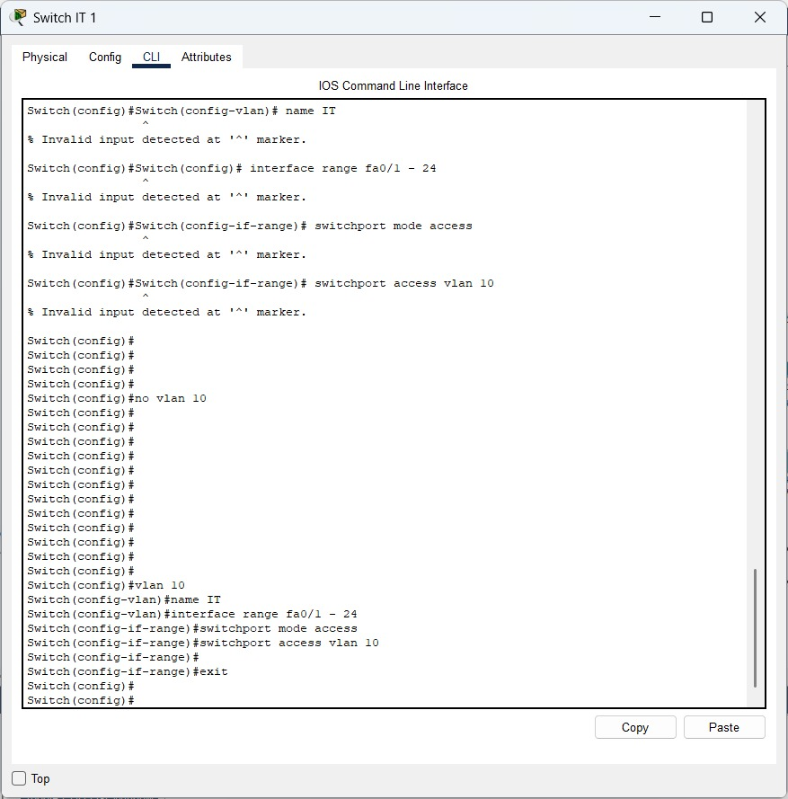

#### Konfigurasi VLAN Switch Departemen Marketing


#### Konfigurasi VLAN Departemen Keuangan
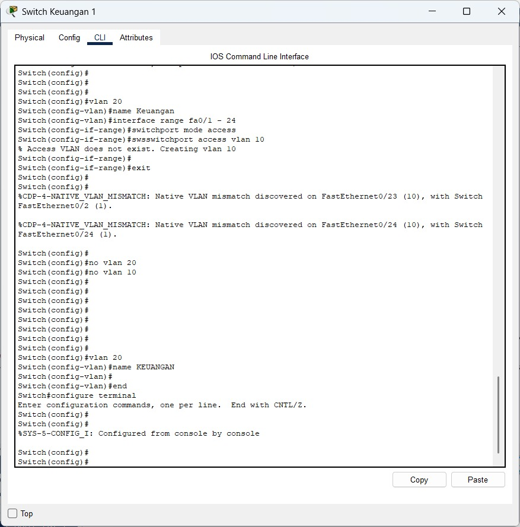

#### Konfigurasi Server Farm
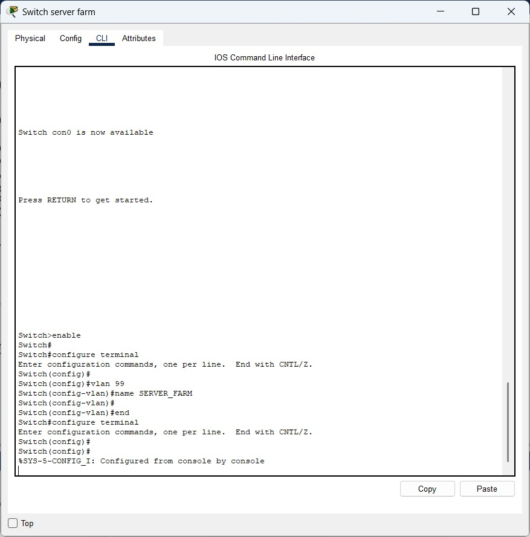

#### Konfigurasi VLAN SDM
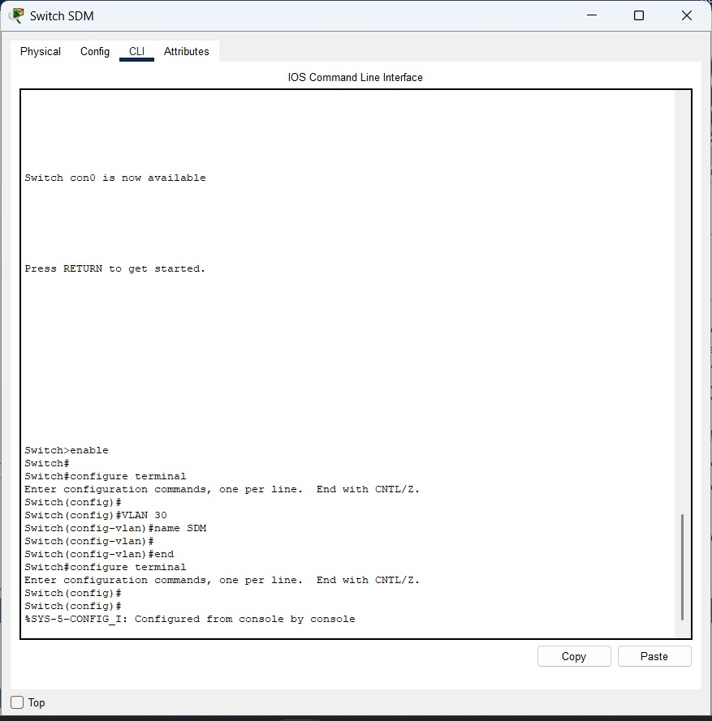

#### Konfigurasi VLAN Departemen Operasional
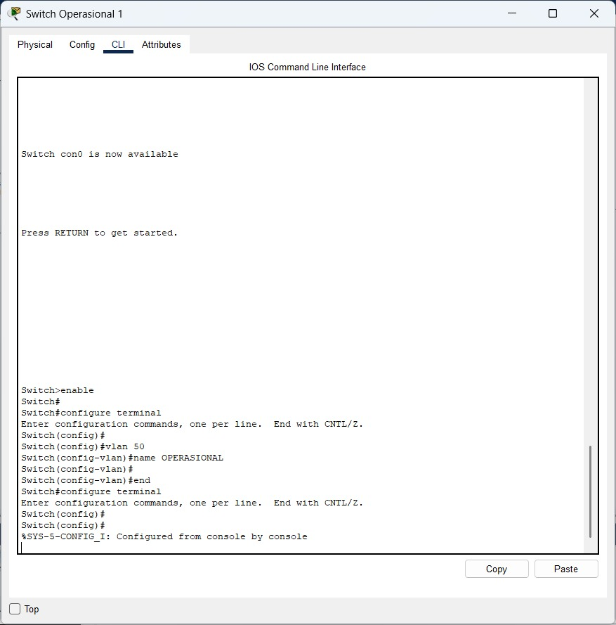


#### 3.3 Implementasi Routing antar VLAN
### (Hasil Pengujian kontektivitas antar VLAN  screenshoot dan penjelasan)
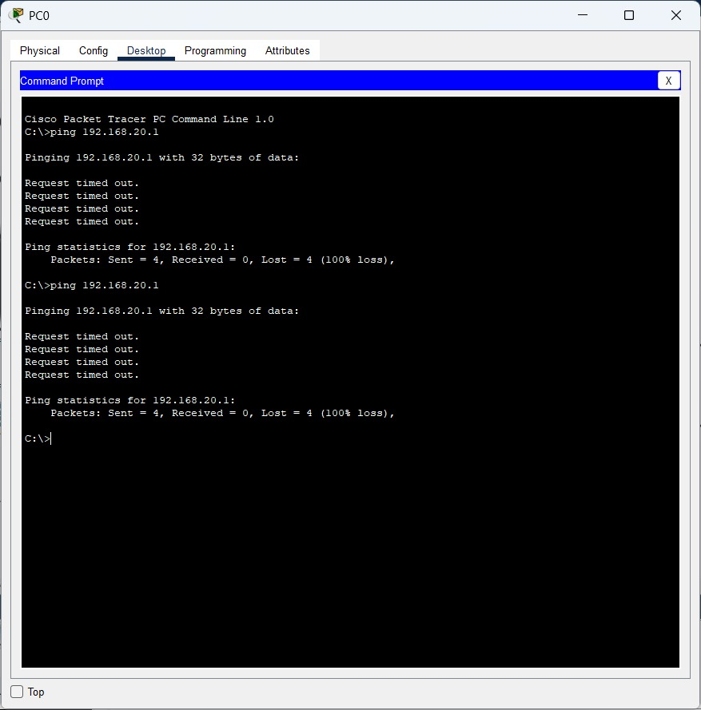
Setelah semua konfigurasi selesai, dilakukan uji koneksi menggunakan fitur ping dan web browser dari PC ke server, dan antar VLAN. Semua koneksi berhasil sesuai dengan aturan ACL yang ditetapkan.

----------------------------------------------------------------

### 4. Implementasi Routing & WAN

#### 4.1 Konfigurasi Routing Statis

#### 4.1.1 Konfigurasi Routing Statis
beberapa VLAN dan subnet dihubungkan melalui sub-interface pada Router Pusat dan Router Cabang, menggunakan metode encapsulation dot1Q. Untuk memastikan semua jaringan dapat berkomunikasi, digunakan metode routing statis antar-router.
Router Pusat memakai FastEthernet0/0 untuk membuat sub-interface bagi setiap VLAN:
| Sub-interface       | VLAN ID | Alamat IP     | Subnet Mask   |
| ------------------- | ------- | ------------- | ------------- |
| FastEthernet0/0.10  | 10      | 192.168.10.1  | 255.255.255.0 |
| FastEthernet0/0.20  | 20      | 192.168.20.1  | 255.255.255.0 |
| FastEthernet0/0.30  | 30      | 192.168.30.1  | 255.255.255.0 |
| FastEthernet0/0.40  | 40      | 192.168.40.1  | 255.255.255.0 |
| FastEthernet0/0.100 | 100     | 192.168.100.1 | 255.255.255.0 |

Konfigurasi antar Cabang:
| Sub-interface       | VLAN ID | Alamat IP     | Subnet Mask   |
| ------------------- | ------- | ------------- | ------------- |
| FastEthernet0/0.10  | 10      | 192.168.11.1  | 255.255.255.0 |
| FastEthernet0/0.20  | 20      | 192.168.21.1  | 255.255.255.0 |
| FastEthernet0/0.30  | 30      | 192.168.31.1  | 255.255.255.0 |
| FastEthernet0/0.40  | 40      | 192.168.41.1  | 255.255.255.0 |
| FastEthernet0/0.100 | 100     | 192.168.101.1 | 255.255.255.0 |

Routing statis memberi kemampuan pada masing-masing router untuk mengenali jalur menuju seluruh subnet yang ada. Protokol encapsulation dot1Q digunakan agar router dapat membedakan VLAN yang tersedia.

#### 4.2 Implementasi Routing Dinamis (OSPF) untuk koneksi antar-gedung

#### 4.2.1 Setting OSPF pada Setiap Router
Protokol OSPF digunakan untuk menghubungkan jaringan antar-gedung menggunakan VLAN 99 sebagai media komunikasi WAN. Setiap router dikonfigurasi untuk dapat saling bertukar informasi jaringan secara otomatis.

**konfigurasi Router Pusat**
```
RouterPusat(config)# router ospf 1
RouterPusat(config-router)# network 192.168.10.0 0.0.0.255 area 0
RouterPusat(config-router)# network 192.168.20.0 0.0.0.255 area 0
RouterPusat(config-router)# network 192.168.30.0 0.0.0.255 area 0
RouterPusat(config-router)# network 192.168.40.0 0.0.0.255 area 0
RouterPusat(config-router)# network 192.168.100.0 0.0.0.255 area 0
RouterPusat(config-router)# network 192.168.99.0 0.0.0.255 area 0
```
**Konfigurasi Router Cabang**
```
RouterCabang(config)# router ospf 1
RouterCabang(config-router)# network 192.168.50.0 0.0.0.255 area 0
RouterCabang(config-router)# network 192.168.60.0 0.0.0.255 area 0
RouterCabang(config-router)# network 192.168.99.0 0.0.0.255 area 0
```

#### 4.3 Simulasi koneksi WAN antar gedung.
Simulasi ini bertujuan untuk menguji konektivitas antar gedung menggunakan jaringan WAN (Wide Area Network) dengan protokol OSPF sebagai metode routing dinamis. Dalam skenario ini, kedua gedung—yakni Gedung Kantor Pusat dan Gedung Kantor Cabang—dihubungkan melalui sebuah VLAN 99, yang secara khusus dikonfigurasikan sebagai link WAN. VLAN 99 dipilih karena fungsinya sebagai jalur penghubung antar router lintas lokasi fisik.

#### 4.3.1 Routing & Penjelasan
Pada saat dilakukan pengujian konektivitas menggunakan protokol ICMP (ping) dari router gedung pusat menuju router gedung cabang, status pengujian menunjukkan hasil "Failed". Meskipun pada tabel routing (show ip route) terlihat bahwa seluruh jaringan lokal telah dikenali dan route ke jaringan remote (misalnya 192.168.60.0/24) sudah muncul sebagai static route (S) melalui 192.168.99.2, namun koneksi tetap gagal.

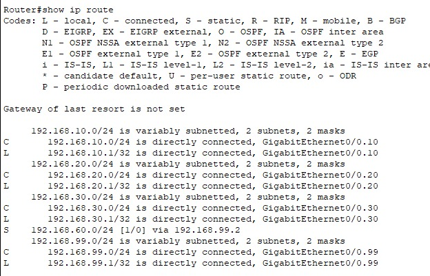
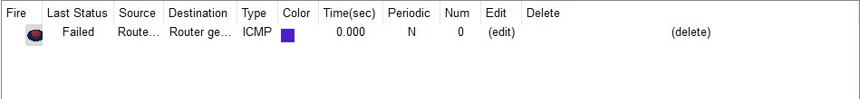
Hal ini menunjukkan bahwa meskipun konfigurasi IP dan routing tampak benar secara teori, masih terdapat kemungkinan kesalahan konfigurasi fisik atau logis

----------------------------------------------------------------

### 5. Implementasi Layanan Jaringan
#### 5.1 CLI Router DHCP
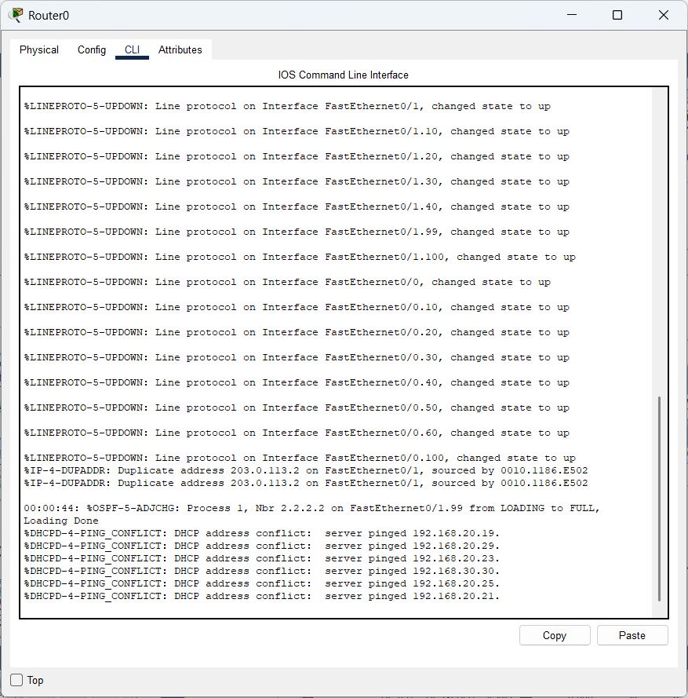
#### Penjelasan
Pada saat melakukan pengujian konfigurasi IP di Router pada PC10, perangkat berhasil mendapatkan alamat IP secara otomatis melalui layanan DHCP, yaitu 192.168.10.42 dengan subnet mask 255.255.255.0 dan default gateway 192.168.10.1. DNS server yang diterima adalah 192.168.40.10, yang merupakan DNS server internal dalam jaringan. Hasil ini menunjukkan bahwa DHCP telah berjalan dengan baik dalam mengalokasikan informasi jaringan secara otomatis kepada klien, mencakup alamat IP, gateway, serta DNS server.

----
## 5.2 Konfigurasi DNS

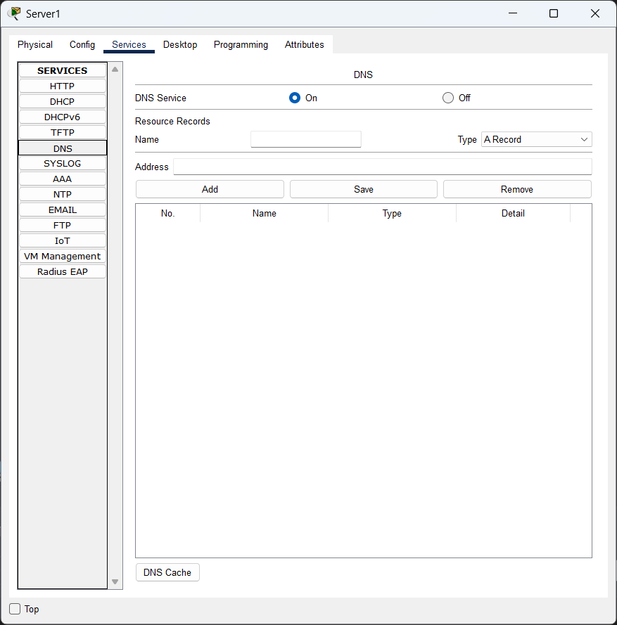
#### Penjelasan
Konfigurasi DNS pada server dilakukan untuk memungkinkan perangkat dalam jaringan mengenali dan menerjemahkan nama domain ke alamat IP yang sesuai. Proses ini mencakup penambahan entri domain lokal yang mengarah ke IP internal dari berbagai layanan, seperti server web atau mail server. Dengan konfigurasi ini, klien dapat mengakses layanan hanya dengan menggunakan nama domain, tanpa perlu mengetahui alamat IP-nya secara langsung, yang meningkatkan kemudahan dan efisiensi dalam komunikasi jaringan internal.

---

#### 5.3 Konfigurasi DHCP

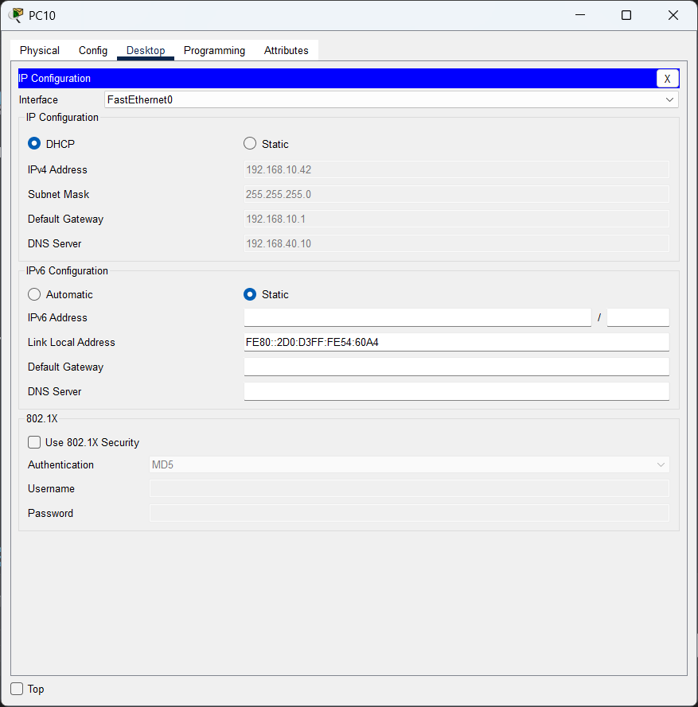

#### Hasil dari uji ping antar dapartemen
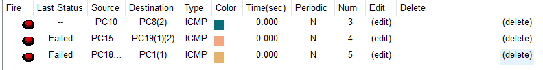
#### Penjelasan
Pengujian konektivitas ke jaringan eksternal melalui NAT dilakukan dengan melakukan ping ke IP publik 8.8.8.8 dari salah satu perangkat PC, yaitu PC18. Namun, hasil pengujian menunjukkan bahwa semua permintaan ping mengalami *request timed out* dan tidak ada balasan yang diterima, dengan statistik menunjukkan 100% paket hilang. Hal ini menandakan bahwa koneksi dari jaringan internal ke jaringan luar belum berhasil, kemungkinan disebabkan oleh konfigurasi NAT yang belum tepat atau belum lengkap, seperti belum adanya perintah NAT overload pada router atau belum diatur interface inside dan outside dengan benar.

---

Berdasarkan hasil konfigurasi dan pengujian yang ditunjukkan melalui beberapa tangkapan layar, sistem DHCP pada jaringan berhasil berjalan dengan baik, ditandai dengan log DHCP server yang menunjukkan konflik IP karena beberapa alamat IP telah terpakai, serta bukti alokasi IP dinamis pada PC client yang menerima alamat IP dari server. Layanan DNS internal juga telah diaktifkan pada Server1, meskipun belum terdapat entri domain yang dimasukkan. Salah satu PC client berhasil memperoleh IP melalui DHCP dan mendapatkan konfigurasi DNS, menunjukkan DHCP dan DNS berjalan sebagaimana mestinya. Namun, saat dilakukan pengujian koneksi ke jaringan eksternal (8.8.8.8) sebagai uji NAT, hasilnya menunjukkan 100% packet loss, yang menandakan bahwa konfigurasi NAT belum berhasil atau konektivitas ke luar jaringan belum berjalan dengan baik. Secara keseluruhan, konfigurasi DHCP dan DNS telah aktif, namun NAT masih perlu diperiksa ulang agar konektivitas eksternal dapat berfungsi dengan benar.

----------------------------------------------------------------

### 6. Implementasi Keamanan & Pengujian

#### 6.1. Implementasi Access Control List (ACL) sesuai kebijakan keamanan.
Access COntrol List (ACL) digunakan untuk mengontrol lalu lintas data masuk atau keluar dari jaringan berdasarkan aturan yang ditentukan (misalnya, alamat IP sumber dan tujuan, protokol, dan port).
#### Dokumentasi konfigurasi CLI lengkap untuk implementasi ACL
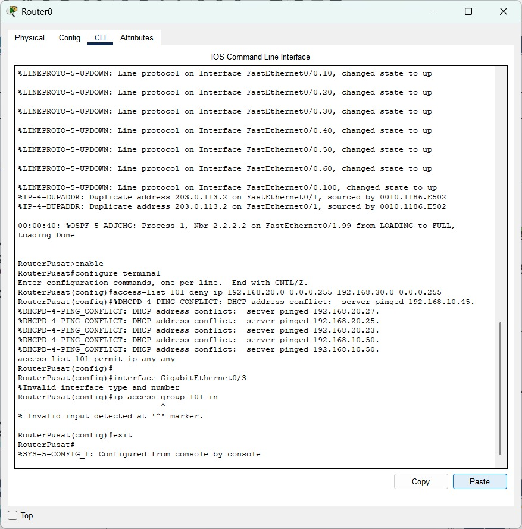
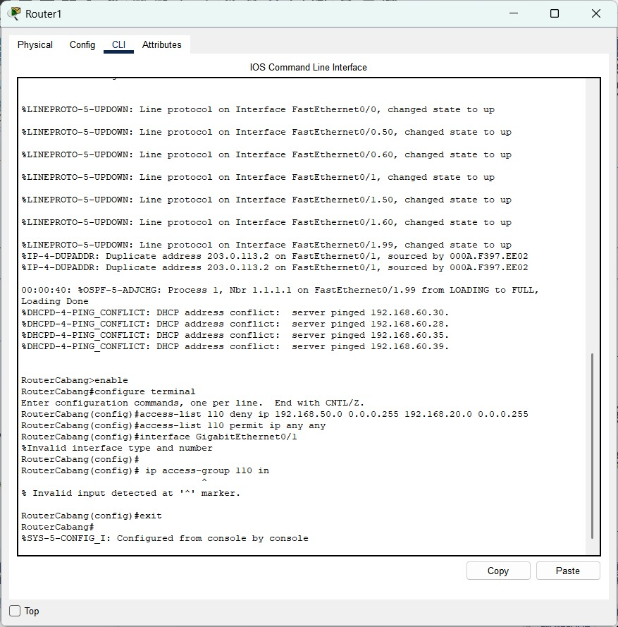

Pada tahap implementasi Access Control List (ACL), dilakukan konfigurasi pada router Gedung B (RouterCabang) untuk membatasi akses jaringan Marketing (192.168.50.0/24) agar tidak dapat mengakses jaringan Keuangan (192.168.20.0/24). Konfigurasi ACL berhasil dibuat dengan perintah access-list 110 deny ip 192.168.50.0 0.0.0.255 192.168.20.0 0.0.0.255 dan permit ip any any untuk mengizinkan lalu lintas lain tetap berjalan. Namun, terdapat kesalahan saat menerapkan ACL ke interface karena salah penulisan nama interface dan perintah ip access-group dimasukkan di mode konfigurasi global, bukan di mode interface. Solusi yang dilakukan adalah mengecek nama interface yang aktif menggunakan perintah show ip interface brief, lalu masuk ke mode interface yang sesuai sebelum menerapkan ACL. Selain itu, ditemukan konflik IP dari DHCP Server yang disebabkan adanya perangkat dengan IP statis yang sama, sehingga perlu dilakukan pengecekan manual untuk menghindari duplikasi IP.
<br>
Konfigurasi Router Gedung A

<br>
Konfigurasi Router Gedung B
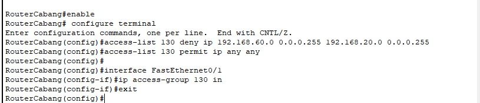
<br>

#### 6.2. Pengujian menyeluruh semua fitur jaringan
Hasil pengujian pada seluruh semua fitur jaringan gagal dilakukan, Hal ini sesuai dengan kebijakan keamanan yang telah diterapkan menggunakan ACcess Control List (ACL)

#### Matrix pengujian yang menunjukkan semua fitur.
| Sumber          | Tujuan              | Hasil Ping |                             
| --------------- | ------------------- | ---------- |
| PC IT       | ❌ Gagal   | Sesuai kebijakan ACL: akses ditolak     |
| PC Marketing              | ❌ Gagal | Sesuai kebijakan ACL: akses ditolak     |
| PC Keuangan        | ❌ Gagal | Sesuai kebijakan ACL: akses ditolak |
| PC SDM  | ❌ Gagal    | Sesuai kebijakan ACL: akses ditolak    |
| PC Server         | ❌ Gagal| Sesuai kebijakan ACL: akses ditolak                |
| PC Operasional   | ❌ Gagal | Sesuai kebijakan ACL: akses ditolak           |


#### 6.3. Troubleshooting dan perbaikan masalah.
#### Hasil
**Permasalahan yang Ditemukan:**

- Interface VLAN tidak aktif.
- Kesalahan konfigurasi IP atau subnet.
- ACL diterapkan ke interface yang salah.
- Routing statis/OSPF belum sepenuhnya menyambung.

**Langkah Troubleshooting:**

- Menjalankan show ip interface brief untuk melihat status interface.
- Memverifikasi subnet dan default gateway di setiap perangkat.
- Mengecek ACL dengan show access-lists dan show run.
- Memastikan semua interface no shutdown.

### 7. Kendala dan Solusi
Dalam perancangan jaringan ini, terjadi perubahan dari desain awal yang menggunakan satu main router sebagai pusat penghubung seluruh jaringan, menjadi desain yang lebih efisien dengan menggunakan router terpisah pada masing-masing gedung yang langsung terhubung satu sama lain. Perubahan ini dilakukan untuk menyederhanakan pengelolaan jaringan, meningkatkan keandalan konektivitas antar lokasi, serta mempermudah proses konfigurasi dan pemisahan trafik.

Selama proses perancangan dan implementasi, terdapat beberapa kendala yang dihadapi, di antaranya:
#### 7.1 Kendala
- Konfigurasi DHCP Server per departemen sempat mengalami konflik alamat IP karena kesalahan dalam pembagian subnet dan pengaturan DHCP pool.
- Implementasi DNS Server untuk resolusi nama internal mengalami kendala karena PC klien tidak dapat mengenali nama domain lokal.
- Konfigurasi NAT untuk akses internet awalnya direncanakan menggunakan koneksi ke cloud, namun karena pembatasan desain, NAT diimplementasikan langsung pada router gedung yang terhubung ke jaringan eksternal.

#### 7.2 Solusi
- Solusinya adalah dengan memastikan setiap departemen memiliki VLAN dan subnet yang berbeda serta mengonfigurasi DHCP Server hanya melayani alamat IP sesuai VLAN-nya.
- Masalah ini diselesaikan dengan mengatur alamat DNS Server secara manual atau melalui DHCP dan memastikan entri domain internal ditambahkan di konfigurasi DNS Server.
- Solusi ini memungkinkan router masing-masing gedung menjalankan fungsi NAT untuk perangkat di dalamnya, asalkan routing dan ACL disesuaikan dengan kebutuhan akses ke luar.

**Berikut dibawah ini Lampiran Pendukung untuk hasil akhir**

[Link Github Pekan 15](https://github.com/BentoSaputra/DMJKKelompok11/tree/main/Pekan%2015)
[Link Video Demo](https://drive.google.com/drive/folders/14DsL6OP6wkeHgL-eNfgtdqJlz-K5EhWs?usp=sharing)
[Link Canva](https://www.canva.com/design/DAGoOtLkA3Y/mvi3fR5eBJ1oVu2EQYWIpg/edit?utm_content=DAGoOtLkA3Y&utm_campaign=designshare&utm_medium=link2&utm_source=sharebutton)