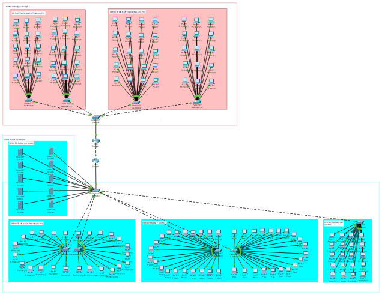
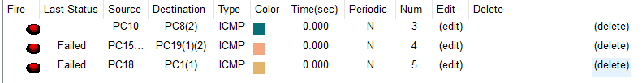

# Week 13

- Ade Ayu Kholifah Putri (10231004) - Network Architech
- Arya Wijaya Saroyo (10231020) - Network Engineer
- Krishandy Dhanysa Pratama (10231050) - Network Services Specialist
- Muhammad Dani (10231062) - Security & Documentation Specialist

-----------------------------------------
## Daftar Isi
1. Topologi jaraingan
     
2. CLI Router DHCP
     
3. Konfigurasi DNS
     
4. Konfigurasi DHCP
    
5. Kesimpulan dan kendala
----

## 1. Topologi

untuk topologi jaringan kami ada sedikit melakukan perubahan dari topologi sebelumnya

**Topologi  Cisco Packet Tracer**
[ Link PKT ](https://github.com/BentoSaputra/DMJKKelompok11/blob/main/Pekan13/Topologi_Kel11.pkt)

----
## 2 CLI Router DHCP 

### penejelasan
Pada konfigurasi DNS di Server1, layanan DNS sudah dalam keadaan aktif (DNS Service: On), namun belum terdapat entri pada kolom Resource Records. Hal ini berarti meskipun server DNS telah dinyalakan, belum ada domain name (seperti `server.local`) yang dapat diresolusikan ke alamat IP tertentu. Untuk membuat DNS bekerja dengan baik, perlu menambahkan entri dengan mengisi kolom Name (misalnya `serverfarm.local`) dan Address (misalnya `192.168.10.100`), lalu menekan tombol Add dan Save. Setelah entri DNS ditambahkan, klien dapat melakukan pengujian resolusi nama menggunakan perintah seperti `ping serverfarm.local`.

----
## 3 Konfigurasi DNS

### Penjelasan
Pada pengujian konfigurasi IP di PC10, terlihat bahwa perangkat telah berhasil memperoleh alamat IP secara dinamis melalui DHCP, yaitu 192.168.10.42 dengan subnet mask 255.255.255.0 dan default gateway 192.168.10.1. Selain itu, alamat DNS server yang digunakan adalah 192.168.40.10, yang merupakan DNS server internal jaringan. Hal ini menunjukkan bahwa layanan DHCP berfungsi dengan baik dalam mendistribusikan parameter jaringan secara otomatis kepada klien, termasuk IP, gateway, dan DNS server.

----
## 4 Konfigurasi DHCP

Hasil dari uji ping anatr dapartemen

### Penjelasan
Pengujian konektivitas ke jaringan eksternal melalui NAT dilakukan dengan melakukan ping ke IP publik 8.8.8.8 dari salah satu perangkat PC, yaitu PC18. Namun, hasil pengujian menunjukkan bahwa semua permintaan ping mengalami *request timed out* dan tidak ada balasan yang diterima, dengan statistik menunjukkan 100% paket hilang. Hal ini menandakan bahwa koneksi dari jaringan internal ke jaringan luar belum berhasil, kemungkinan disebabkan oleh konfigurasi NAT yang belum tepat atau belum lengkap, seperti belum adanya perintah NAT overload pada router atau belum diatur interface inside dan outside dengan benar.

---
## 5 Kesimpulan

Berdasarkan hasil konfigurasi dan pengujian yang ditunjukkan melalui beberapa tangkapan layar, sistem DHCP pada jaringan berhasil berjalan dengan baik, ditandai dengan log DHCP server yang menunjukkan konflik IP karena beberapa alamat IP telah terpakai, serta bukti alokasi IP dinamis pada PC client yang menerima alamat IP dari server. Layanan DNS internal juga telah diaktifkan pada Server1, meskipun belum terdapat entri domain yang dimasukkan. Salah satu PC client berhasil memperoleh IP melalui DHCP dan mendapatkan konfigurasi DNS, menunjukkan DHCP dan DNS berjalan sebagaimana mestinya. Namun, saat dilakukan pengujian koneksi ke jaringan eksternal (8.8.8.8) sebagai uji NAT, hasilnya menunjukkan 100% packet loss, yang menandakan bahwa konfigurasi NAT belum berhasil atau konektivitas ke luar jaringan belum berjalan dengan baik. Secara keseluruhan, konfigurasi DHCP dan DNS telah aktif, namun NAT masih perlu diperiksa ulang agar konektivitas eksternal dapat berfungsi dengan benar.

## Kendala
Seperti pada penjelasan Routing * Penjelasan mengenai pengujian konektivitas protokol (ping) terjadi kegagalan dalam terhubungnya antar Router Gedung.

[Link Github Pekan 13](https://github.com/BentoSaputra/DMJKKelompok11/tree/main/Pekan13)