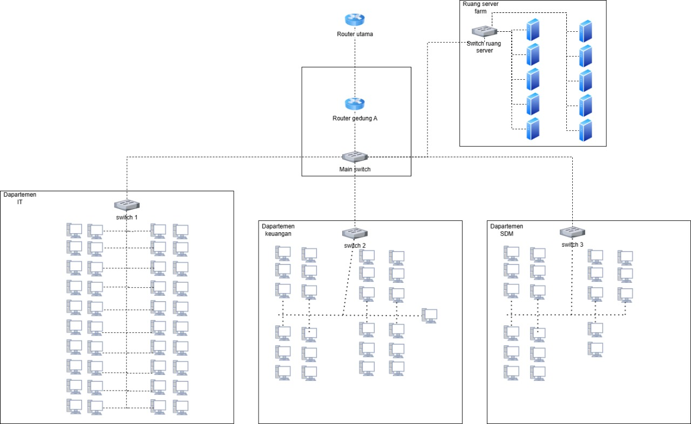
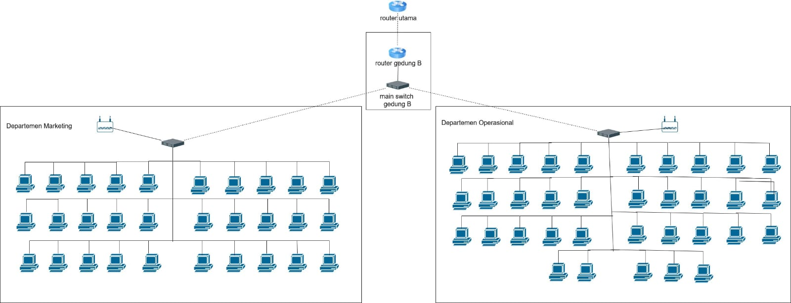

# Desain Manajemen dan Jaringan Komputer

## 1. Judul dan Identitas Kelompok

**Judul Proyek:**  
> Desain dan Manajemen Jaringan PT.Nusantara Network

**Kelompok : 11**  
- Ade Ayu Kholifah Putri (10231004) - Network Architech
- Arya Wijaya Saroyo (10231020) - Network Engineer
- Krishandy Dhanysa Pratama (10231050) - Network Services Specialist
- Muhammad Dani (10231062) - Security & Documentation Specialist

---

## 2. Daftar Isi

1. [Judul dan Identitas Kelompok](#1-judul-dan-identitas-kelompok)  
2. [Daftar Isi](#2-daftar-isi)  
3. [Bagian Utama (Deliverable Per Pekan)](#3-bagian-utama-sesuai-dengan-deliverable-per-pekan)  
4. [Dokumentasi CLI Commands](#4-dokumentasi-cli-commands)  
5. [Screenshot dengan Penjelasan](#5-screenshot-dengan-penjelasan)  
6. [Kesimpulan dan Pembelajaran](#6-kesimpulan-dan-pembelajaran)  

---

## 3. Bagian Utama (sesuai dengan deliverable per pekan)

### 3.1 Pendahuluan
Perkembangan teknologi informasi saat ini telah membawa dampak besar terhadap operasional perusahaan di berbagai sektor. Infrastruktur jaringan komputer menjadi tulang punggung dalam mendukung proses komunikasi, pengolahan data, serta layanan digital internal perusahaan. PT. Nusantara Network, sebagai perusahaan yang bergerak di bidang teknologi informasi, membutuhkan sistem jaringan yang andal, aman, dan efisien untuk mendukung aktivitas seluruh departemen di kantor pusat maupun cabang.

Seiring dengan meningkatnya kompleksitas operasional, PT. Nusantara Network memiliki kebutuhan untuk membangun infrastruktur jaringan yang mampu menjamin keamanan antar departemen, efisiensi pertukaran data antar gedung, serta kemudahan dalam pengelolaan sistem secara terpusat. Oleh karena itu, diperlukan analisis kebutuhan jaringan yang menyeluruh sebagai dasar dalam perencanaan dan implementasi sistem jaringan perusahaan yang optimal.

### 3.2 Latar Belakang
PT. Nusantara Network memiliki dua lokasi operasional utama, yaitu kantor pusat (Gedung A) dan kantor cabang (Gedung B), dengan masing-masing terdiri atas beberapa departemen dan unit kerja. Total perangkat yang digunakan meliputi puluhan komputer client dan beberapa server yang menjalankan berbagai layanan penting perusahaan.

Kondisi tersebut menuntut penerapan teknologi jaringan yang mampu mengakomodasi kebutuhan khusus seperti segmentasi jaringan antar departemen, akses internet terpusat, serta konektivitas antar lokasi yang stabil meskipun menggunakan bandwidth terbatas. Selain itu, dibutuhkan pula pengaturan layanan jaringan seperti DHCP, DNS, dan pengamanan akses melalui Access Control List (ACL). Dalam hal pengelolaan dan skalabilitas jaringan, penggunaan routing dinamis seperti OSPF dan sistem monitoring jaringan menjadi hal yang penting untuk dipertimbangkan.

Melalui proposal ini, tim kami bertujuan untuk menyusun analisis kebutuhan infrastruktur jaringan yang akan menjadi landasan awal dalam merancang sistem jaringan yang sesuai dengan kebutuhan dan tantangan yang dihadapi oleh PT. Nusantara Network.

### 3.3 Ruang Linkgup
Ruang lingkup dalam proposal ini mencakup analisis kebutuhan infrastruktur jaringan PT. Nusantara Network berdasarkan struktur organisasi, jumlah perangkat, dan kebutuhan layanan jaringan. Fokus utama dari ruang lingkup ini adalah:

1. Analisis Topologi Jaringan untuk kantor pusat dan kantor cabang.
2. Perancangan VLAN untuk segmentasi antar departemen.
3. Kebutuhan koneksi WAN antar lokasi dengan bandwidth terbatas.
4. Implementasi NAT untuk akses internet melalui ISP.
5. Penerapan layanan DHCP dan DNS untuk pengaturan alamat IP dan resolusi nama.
6. Perancangan Access Control List (ACL) untuk pembatasan akses antar VLAN.
7. Penggunaan protokol routing dinamis (OSPF) untuk pengelolaan rute jaringan.
8. Sistem monitoring dan manajemen jaringan terpusat untuk pemantauan performa dan keamanan jaringan.

Ruang lingkup ini tidak mencakup implementasi fisik atau konfigurasi langsung perangkat, namun lebih berfokus pada tahap analisis kebutuhan dan rancangan awal infrastruktur jaringan.

### 3.4 Jadwal dan Delieverable Pekan
Jadwal dan Delieverable Pekan berisikan urutan waktu pelaksanaan dalam analisis yang dilakukan oleh kelompok kami, dan pengerjaan pada PT. Nusantara Network Sebagai Berikut.

### Jadwal
| Pekan | Kegiatan | Deadline |
|-------|----------|----------|
|Pekan 9|1. Pembagian Kelompok dan Pembagian Peran 2. Analisis Kebutuhan PT. Nusantara Network 3. Brainstorming desain jaringan awal.|Minggu, 13 April 2025|
|Pekan 10|----------|Jum`at, 18 April 2025|
|Pekan 11|----------|Jum`at, 25 April 2025|
|Pekan 12|----------|Jum`at, 2 Mei 2025|
|Pekan 13|----------|Jum`at, 9 Mei 2025|
|Pekan 14|----------|Jum`at, 16 Mei 2025|
|Pekan 15|----------|Jum`at, 23 Mei 2025|

### 3.5 Analisis Kebutuhan PT. Nusantara Network
PT. Nusantara Network merupakan perusahaan yang bergerak di bidang teknologi informasi dengan kebutuhan jaringan yang kompleks, mencakup keamanan data, efisiensi komunikasi, serta kemudahan dalam pengelolaan jaringan. Infrastruktur jaringan harus dirancang untuk melayani dua lokasi yaitu kantor pusat (Gedung A) dan kantor cabang (Gedung B), dengan masing-masing lokasi memiliki beberapa departemen.

1. Segmentasi Jaringan dengan VLAN
Untuk menjamin keamanan data dan menghindari kemacetan lalu lintas jaringan antar departemen, perlu dilakukan segmentasi jaringan menggunakan Virtual Local Area Network (VLAN). Setiap departemen akan ditempatkan dalam VLAN yang berbeda agar dapat mengisolasi lalu lintas data antar divisi, serta mempermudah pengaturan akses dan troubleshooting.

Rancangan VLAN yang Dibutuhkan:

VLAN 10: Departemen IT (40 perangkat)

VLAN 20: Departemen Keuangan (25 perangkat)
VLAN 30: Departemen SDM (20 perangkat)
VLAN 40: Departemen Marketing (30 perangkat)
VLAN 50: Departemen Operasional (35 perangkat)
VLAN 99: Server Farm (10 server)

Setiap VLAN akan dikonfigurasi dengan subnet yang berbeda agar memudahkan pengalokasian IP dan manajemen lalu lintas jaringan.

2. Koneksi Antar Gedung (WAN)
Koneksi antara kantor pusat dan kantor cabang memerlukan jaringan Wide Area Network (WAN). Karena lokasi berada di gedung yang berbeda, koneksi WAN menjadi krusial untuk memastikan kelancaran komunikasi dan transfer data antar cabang.

Teknologi yang Direkomendasikan:

VPN Site-to-Site jika ingin solusi hemat biaya menggunakan jaringan internet.

Leased Line atau MPLS jika memerlukan koneksi lebih stabil dan aman.

Pertimbangan Bandwidth: Mengingat koneksi WAN memiliki bandwidth terbatas, perlu dilakukan pengaturan Quality of Service (QoS) agar trafik penting seperti akses ke server memiliki prioritas tinggi.

3. Implementasi NAT (Network Address Translation)
Akses ke internet akan menggunakan NAT, yang berfungsi untuk menerjemahkan alamat IP privat dari masing-masing perangkat dalam jaringan ke alamat IP publik dari penyedia layanan internet (ISP).

NAT akan diterapkan pada router utama di kantor pusat.

Hanya alamat IP publik dari ISP yang terlihat di internet, sementara alamat IP internal tetap tersembunyi demi keamanan.

4. Layanan DHCP untuk Alokasi IP Otomatis
Agar pengalokasian alamat IP lebih efisien dan menghindari konflik IP, setiap departemen memerlukan layanan Dynamic Host Configuration Protocol (DHCP).

DHCP dapat disediakan secara terpusat atau disebarkan ke masing-masing VLAN.

Untuk distribusi antar VLAN, dibutuhkan fitur DHCP Relay pada router atau switch Layer 3 agar setiap perangkat bisa mendapatkan IP sesuai subnet VLAN-nya.

5. Layanan DNS (Domain Name System)
DNS diperlukan untuk menerjemahkan nama domain menjadi alamat IP, baik untuk keperluan internal (intranet) maupun eksternal (internet).

DNS Internal: Mengatur domain lokal seperti fileserver.nusnet.local.

DNS Eksternal: Mengarahkan permintaan eksternal ke DNS publik (seperti Google DNS 8.8.8.8).

Disarankan untuk memiliki DNS Primer dan Sekunder agar layanan tetap tersedia jika salah satu DNS gagal.

6. Access Control List (ACL) untuk Keamanan Lalu Lintas
Untuk memperkuat keamanan jaringan, perlu diterapkan Access Control List (ACL) pada perangkat Layer 3 seperti router atau switch multilayer.

Fungsi ACL adalah membatasi akses antar VLAN sesuai kebijakan yang ditentukan.

Contoh kebijakan:

Departemen SDM hanya bisa mengakses layanan internet dan file sharing terbatas.

Departemen IT memiliki akses penuh ke semua departemen untuk keperluan teknis.

Server Farm hanya dapat diakses oleh departemen tertentu saja.

7. Routing Dinamis dengan OSPF
Untuk pengelolaan rute jaringan yang efisien antar gedung dan antar VLAN, digunakan protokol Open Shortest Path First (OSPF).

OSPF secara otomatis memperbarui rute jika terjadi perubahan jaringan.

Mengurangi kebutuhan konfigurasi manual seperti pada routing statis.

Cukup menggunakan satu area (Area 0) karena kompleksitas jaringan masih dalam skala menengah.

8. Monitoring dan Manajemen Jaringan Terpusat
Agar jaringan tetap dalam kondisi optimal dan mudah dikontrol, dibutuhkan sistem pemantauan yang menyeluruh.

Gunakan aplikasi monitoring seperti:

- Zabbix, PRTG Network Monitor, atau SolarWinds.

Fungsi Monitoring:

- Memantau kinerja perangkat jaringan (router, switch, server).

- Memberikan notifikasi jika terjadi gangguan.

- Merekam log aktivitas untuk audit dan troubleshooting.

Gunakan protokol SNMP dan sistem log terpusat agar semua aktivitas dapat dimonitor dari satu dashboard.

### 3.6 Topologi Jaringan

Topologi jaringan adalah pola atau skema yang mendefinisikan cara perangkat-perangkat dalam suatu jaringan (seperti komputer, server, atau perangkat jaringan) saling terhubung dan berkomunikasi, baik secara fisik maupun logis. Berikut Gambar Topologi Jaringan pada PT. Nusantara Network



<p align="center">Gambar.1 Topologi Jaringan Gedung A</p>



<p align="center">Gambar.2 Topologi Jaringan Gedung B</p>

Pada kedua Gambar Diatas dapat dilihat bahwa masing masing gedung memiliki Router dan Main Switch sendiri yang mengarah ke masing masing ruangan pada Setiap gedung namun ada beberapa perbedaan

Pada Gedung A Terdapat Ruang Server Farm yang terhubung dari main Switch, dengan fungsi diantara lain Menjalankan Server, Hosting Pengolahan data dan lain lain.

Pada Gedung B Terdapat Access Point untuk dapat digunakan pengguna pada ruangan Meeting dan Ruang Operasional

Namun pada kedua Gedung tersebut terdapat Router utama yang saling terhubung antar gedung A dengan Gedung B
---

## 4. Dokumentasi CLI Commands

### 4.1 Konfigurasi Lengkap

#### Perangkat: [Nama/Hostname Router/Switch]
```bash

...
